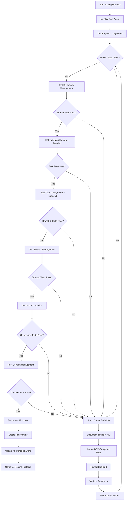

# MCP Tool Testing Protocol - Decision Tree

I no need make report, i want coder agent correct code issue by finding on test

## 🚀 Entry Point
```
START → Call @test_orchestrator_agent
```

## 📋 Testing Decision Tree



## 🎯 Test Execution Flow

### Phase 1: Project Management Tests
```
IF testing project management:
    CREATE 2 projects
    TEST get, list, update, health_check
    SET project context
    
    IF any_error:
        STOP → CREATE todo_list → FIX → RESTART → RETEST
    ELSE:
        PROCEED to Phase 2
```

### Phase 2: Git Branch Management Tests
```
IF testing git branches:
    CREATE 2 branches
    TEST get, list, update, agent_assignment
    SET branch context
    
    IF any_error:
        STOP → CREATE todo_list → FIX → RESTART → RETEST
    ELSE:
        PROCEED to Phase 3
```

### Phase 3: Task Management Tests
```
IF testing task management:
    BRANCH 1:
        CREATE 5 tasks
        TEST update, get, list, search, next
        ADD random dependencies
        ASSIGN agents
    
    BRANCH 2:
        CREATE 2 tasks
        TEST same operations as Branch 1
    
    IF any_error:
        STOP → CREATE todo_list → FIX → RESTART → RETEST
    ELSE:
        PROCEED to Phase 4
```

### Phase 4: Subtask Management Tests
```
IF testing subtasks:
    FOR each task in Branch 1:
        CREATE 4 subtasks
        FOLLOW TDD steps
        TEST update, list, get, complete
    
    IF any_error:
        STOP → CREATE todo_list → FIX → RESTART → RETEST
    ELSE:
        PROCEED to Phase 5
```

### Phase 5: Task Completion Tests
```
IF testing task completion:
    SELECT 1 task from Branch 1
    COMPLETE with full summary
    VERIFY completion status
    
    IF any_error:
        STOP → CREATE todo_list → FIX → RESTART → RETEST
    ELSE:
        PROCEED to Phase 6
```

### Phase 6: Context Management Tests
```
IF testing context management:
    VERIFY global context
    VERIFY project context
    VERIFY branch context  
    VERIFY task context
    TEST inheritance flow
    
    IF any_error:
        STOP → CREATE todo_list → FIX → RESTART → RETEST
    ELSE:
        PROCEED to Phase 7
```

### Phase 7: Documentation & Fix Generation
```
IF all tests complete OR errors encountered:
    DOCUMENT all issues in MD format
    SAVE to dhafnck_mcp_main/docs/issues/
    CREATE detailed fix prompts
    UPDATE all context layers
```

## 🔄 Error Handling Loop

```
ON ERROR:
1. STOP current test immediately
2. CREATE todo list with specific error details
3. WRITE issue to dhafnck_mcp_main/docs/issues/mcp-testing-issues-{date}.md
4. GENERATE fix prompt with DDD compliance requirements
5. APPLY fixes following Domain-Driven Design patterns
6. RESTART backend: docker-compose down && docker-compose up
7. VERIFY changes in Supabase dashboard
8. RETURN to failed test and continue from that point
```

## 📝 Todo List Remake Protocol

```
WHEN creating todo list after error:
1. IDENTIFY specific failing operation
2. ANALYZE error with DDD compliance lens
3. CREATE fix prompt with implementation details
4. RESTART backend after applying fixes
5. VERIFY database changes in Supabase
6. RETEST from point of failure
7. CONTINUE with remaining test phases
```

## 🎯 Success Criteria

```
ALL PHASES MUST PASS:
✅ Project Management (2 projects + operations)
✅ Git Branch Management (2 branches + operations) 
✅ Task Management (5+2 tasks + operations)
✅ Subtask Management (4 per task + operations)
✅ Task Completion (1 complete task)
✅ Context Management (all 4 layers)
✅ Issue Documentation (complete MD file)
✅ Context Updates (all layers updated)
```

## 📁 Output Locations

- **Issues**: `dhafnck_mcp_main/docs/issues/mcp-testing-issues-{date}.md`
- **Fix Prompts**: Same MD file, section "Fix Prompts"
- **Context Updates**: All 4 context layers (global, project, branch, task)
