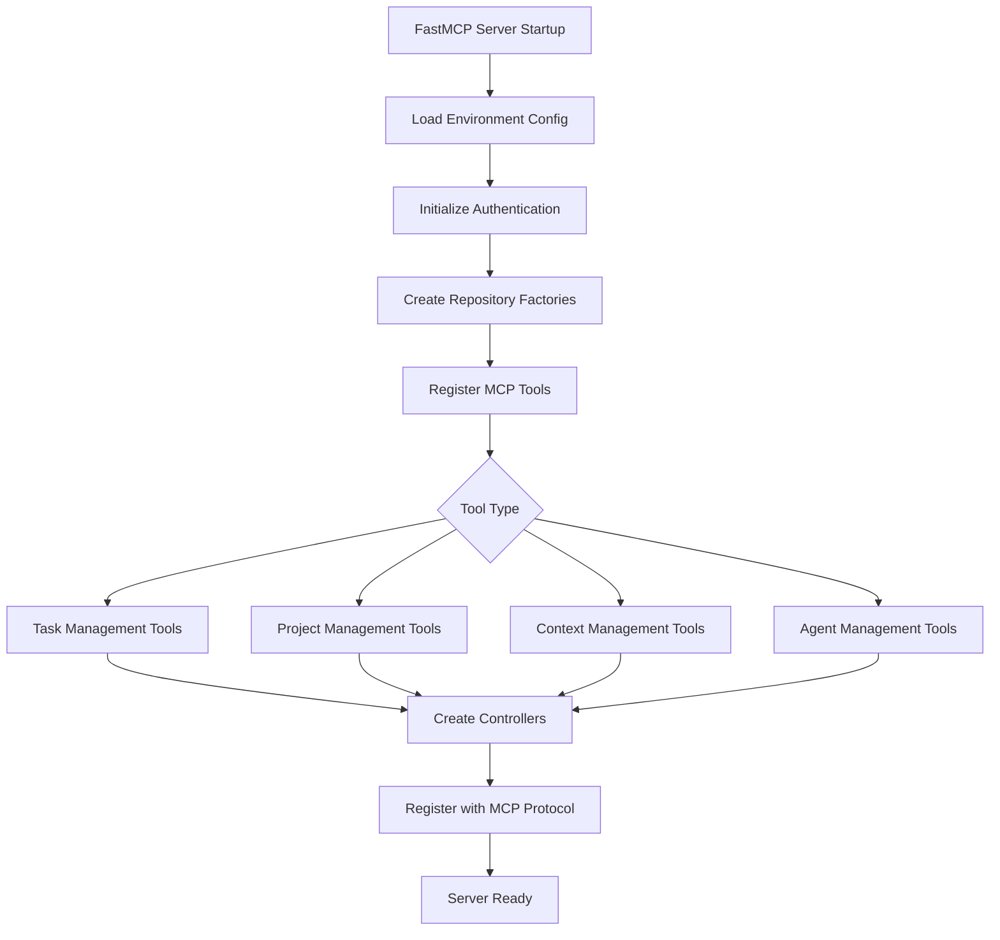

 
Your job is call agent to  **analyze, detect and modify code** so it fully respects Domain-Driven Design (DDD) principles while keeping the original business logic intact.

## Rules:
1. Always check if the code respects the 4-layer DDD structure
2. If any code violates these boundaries (e.g., domain depending on infrastructure), refactor it to respect boundaries.
3. Detect large classes/functions → refactor into smaller, single-responsibility units.
4. Detect duplicated or similar code → extract a **factory, utility, or shared service**.
5. Propose better naming and module organization to align with **ubiquitous language**.
6. Update changelog for every detected issue:
   - Explain why it violates DDD
   - If reusable, create a **factory/service/abstract class**
   - If too large, split into multiple smaller files/components.

## Output format:
- ✅ Compliant parts: mention what already respects DDD
- ⚠️ Violations: explain the issue + show refactor on changelog
- 🏭 Factory candidates: show extracted code for reuse
- ✂️ Large code: show the split plan and refactored code

## Important:
- Always keep the **original business logic intact**.
- Prefer **small, explicit refactors** over massive rewrites.
- Code must be ready-to-run after modification.
- Use clean naming conventions consistent with DDD.

## 🏗️ Architecture Overview

### System Architecture Diagram
```
┌──────────────────────────────────────────────────────┐
│                  MCP Request Entry                   │
│            (FastMCP Protocol Layer)                 │
└────────────────────┬─────────────────────────────────┘
                     ↓
┌──────────────────────────────────────────────────────┐
│         INTERFACE LAYER (Controllers)                │
│  • MCP Protocol Handlers                            │
│  • Request/Response Serialization                   │
│  • Parameter Validation & Coercion                  │
│  • Authentication Middleware                        │
│  • Error Response Formatting                        │
└────────────────────┬─────────────────────────────────┘
                     ↓
┌──────────────────────────────────────────────────────┐
│      APPLICATION LAYER (Facades & Use Cases)         │
│  • Application Facades (Entry Points)               │
│  • Use Case Orchestration                           │
│  • Transaction Management                           │
│  • DTO Transformations                              │
│  • Cross-Cutting Concerns (Logging, Validation)     │
│  • Event Handling & Publishing                      │
└────────────────────┬─────────────────────────────────┘
                     ↓
┌──────────────────────────────────────────────────────┐
│         DOMAIN LAYER (Business Logic)                │
│  • Domain Entities (Task, Project, Agent, etc.)     │
│  • Value Objects (TaskId, Priority, Status)         │
│  • Domain Services (Validation, State Transitions)  │
│  • Domain Events (TaskCreated, ProgressUpdated)     │
│  • Repository Interfaces (Abstractions)             │
│  • Domain Specifications & Business Rules           │
└────────────────────┬─────────────────────────────────┘
                     ↓
┌──────────────────────────────────────────────────────┐
│     INFRASTRUCTURE LAYER (Implementations)           │
│                                                      │
│  ┌─────────────────────────────────────────┐         │
│  │         Repository Factory               │        │
│  │  Environment-Based Implementation       │        │
│  │  Selection (Test/Dev/Prod)              │        │
│  └──────────────┬──────────────────────────┘         │
│                 ↓                                    │
│  ┌──────────────────────────────────────────┐        │
│  │     Environment & Config Detection       │        │
│  │  DATABASE_TYPE, REDIS_ENABLED, etc.     │        │
│  └──────┬───────────────────┬───────────────┘        │
│         ↓                   ↓                        │
│    TEST MODE           PRODUCTION MODE               │
│         ↓                   ↓                        │
│  ┌──────────────┐   ┌──────────────┐                 │
│  │   SQLite     │   │   Supabase   │                 │
│  │  Repository  │   │  Repository  │                 │
│  │   (Local)    │   │  (Cloud DB)  │                 │
│  └──────────────┘   └───────┬──────┘                 │
│                             ↓                        │
│                    ┌─────────────────┐               │
│                    │ Cache Layer?    │               │
│                    │ (Redis/Memory)  │               │
│                    └────┬──────┬─────┘               │
│                        YES     NO                    │
│                         ↓       ↓                    │
│                  ┌─────────┐  ┌──────────┐           │
│                  │ Cached  │  │  Direct  │           │
│                  │  Repos  │  │   DB     │           │
│                  └─────────┘  └──────────┘           │
└──────────────────────────────────────────────────────┘
```

### FastMCP Server Integration
```
┌─────────────────────────────────────────────────────┐
│                FastMCP Server                       │
│  ┌─────────────────────────────────────────────┐    │
│  │            MCP Protocol Handler             │    │
│  │  • Tool Registration & Discovery           │    │
│  │  • Request Routing & Dispatch              │    │
│  │  • WebSocket/HTTP Transport                │    │
│  │  • Session Management                      │    │
│  └─────────────────────────────────────────────┘    │
│  ┌─────────────────────────────────────────────┐    │
│  │         Authentication Layer                │    │
│  │  • JWT Token Validation                    │    │
│  │  • Bearer Token Authentication             │    │
│  │  • Rate Limiting & Security                │    │
│  │  • User Context Propagation                │    │
│  └─────────────────────────────────────────────┘    │
│  ┌─────────────────────────────────────────────┐    │
│  │    Consolidated MCP Tools Registration      │    │
│  │  • Task Management Tools                   │    │
│  │  • Project Management Tools                │    │
│  │  • Context Management Tools                │    │
│  │  • Agent Management Tools                  │    │
│  │  • Connection Management Tools             │    │
│  └─────────────────────────────────────────────┘    │
└─────────────────────────────────────────────────────┘
```

## 🏛️ Domain-Driven Design Components

### 1. Domain Entities
Domain entities represent the core business objects with identity and lifecycle management:

#### Task Entity
```python
# Located: dhafnck_mcp_main/src/fastmcp/task_management/domain/entities/task.py
@dataclass
class Task:
    """Task domain entity with business logic"""
    
    title: str
    description: str
    id: TaskId | None = None
    status: TaskStatus | None = None
    priority: Priority | None = None
    git_branch_id: str | None = None
    
    # Business methods
    def can_be_completed(self) -> bool
    def update_progress(self, percentage: int) -> None
    def assign_to_agent(self, agent_id: str) -> None
    def add_dependency(self, task_id: TaskId) -> None
```

#### Project Entity
```python
# Located: dhafnck_mcp_main/src/fastmcp/task_management/domain/entities/project.py
@dataclass
class Project:
    """Project aggregate root managing project lifecycle"""
    
    name: str
    description: str
    id: str | None = None
    created_at: datetime | None = None
    
    # Aggregate methods
    def create_branch(self, branch_name: str) -> GitBranch
    def assign_agent(self, agent_id: str, branch_id: str) -> None
    def health_check(self) -> ProjectHealthStatus
```

#### Agent Entity
```python
# Located: dhafnck_mcp_main/src/fastmcp/task_management/domain/entities/agent.py
@dataclass
class Agent:
    """Agent entity representing AI assistants"""
    
    name: str
    capabilities: List[str]
    assigned_branches: List[str] = field(default_factory=list)
    
    # Domain logic
    def can_handle_task_type(self, task_type: str) -> bool
    def assign_to_branch(self, branch_id: str) -> None
```

### 2. Value Objects
Immutable objects representing concepts without identity:

#### TaskId Value Object
```python
# Located: dhafnck_mcp_main/src/fastmcp/task_management/domain/value_objects/task_id.py
@dataclass(frozen=True)
class TaskId:
    """Immutable task identifier"""
    value: str
    
    def __post_init__(self):
        if not self.value or len(self.value.strip()) == 0:
            raise ValueError("TaskId cannot be empty")
```

#### Priority Value Object
```python
# Located: dhafnck_mcp_main/src/fastmcp/task_management/domain/value_objects/priority.py
@dataclass(frozen=True)
class Priority:
    """Task priority value object with business rules"""
    level: PriorityLevel
    
    def is_higher_than(self, other: 'Priority') -> bool
    def can_override(self, other: 'Priority') -> bool
```

#### TaskStatus Value Object
```python
# Located: dhafnck_mcp_main/src/fastmcp/task_management/domain/value_objects/task_status.py
@dataclass(frozen=True)
class TaskStatus:
    """Task status with state transition rules"""
    status: TaskStatusEnum
    
    def can_transition_to(self, new_status: TaskStatusEnum) -> bool
    def get_valid_transitions(self) -> List[TaskStatusEnum]
```

### 3. Domain Services
Stateless services containing business logic that doesn't belong to a single entity:

#### Task Validation Service
```python
# Located: dhafnck_mcp_main/src/fastmcp/task_management/domain/services/task_validation_service.py
class TaskValidationService:
    """Domain service for complex task business validation"""
    
    def validate_task_dependencies(self, task: Task, 
                                 dependency_tasks: List[Task]) -> ValidationResult
    
    def validate_agent_assignment(self, task: Task, 
                                agent: Agent) -> ValidationResult
    
    def validate_task_completion_requirements(self, task: Task) -> ValidationResult
```

#### Task State Transition Service
```python
# Located: dhafnck_mcp_main/src/fastmcp/task_management/domain/services/task_state_transition_service.py
class TaskStateTransitionService:
    """Manages complex task state transitions"""
    
    def transition_task_status(self, task: Task, 
                             new_status: TaskStatus) -> TransitionResult
    
    def calculate_dependent_task_impacts(self, task: Task) -> List[TaskId]
    
    def validate_completion_prerequisites(self, task: Task) -> bool
```

#### Dependency Validation Service
```python
# Located: dhafnck_mcp_main/src/fastmcp/task_management/domain/services/dependency_validation_service.py
class DependencyValidationService:
    """Validates task dependency graphs"""
    
    def detect_circular_dependencies(self, task_id: TaskId, 
                                   dependencies: List[TaskId]) -> bool
    
    def validate_dependency_chain(self, task_chain: List[Task]) -> ValidationResult
```

### 4. Domain Events
Events representing significant business occurrences:

#### Task Events
```python
# Located: dhafnck_mcp_main/src/fastmcp/task_management/domain/events/task_events.py
@dataclass
class TaskCreated:
    """Event fired when a new task is created"""
    task_id: TaskId
    project_id: str
    created_by: str
    created_at: datetime

@dataclass
class TaskCompleted:
    """Event fired when a task is completed"""
    task_id: TaskId
    completion_summary: str
    completed_by: str
    completed_at: datetime
```

#### Progress Events
```python
# Located: dhafnck_mcp_main/src/fastmcp/task_management/domain/events/progress_events.py
@dataclass
class ProgressUpdated:
    """Event fired when task progress changes"""
    task_id: TaskId
    old_progress: int
    new_progress: int
    updated_by: str

@dataclass
class ProgressMilestoneReached:
    """Event fired when significant progress milestones are hit"""
    task_id: TaskId
    milestone: int
    achieved_at: datetime
```

### 5. Domain Specifications
Business rules expressed as reusable specifications:

#### Task Completion Specification
```python
# Located: dhafnck_mcp_main/src/fastmcp/task_management/domain/specifications/task_completion_spec.py
class TaskCompletionSpecification:
    """Specification for task completion requirements"""
    
    def is_satisfied_by(self, task: Task) -> bool:
        return (
            task.status.can_transition_to(TaskStatusEnum.DONE) and
            self._all_dependencies_completed(task) and
            self._has_valid_completion_summary(task)
        )
```

### 6. Domain Factories
Complex object creation logic:

#### Task Factory
```python
# Located: dhafnck_mcp_main/src/fastmcp/task_management/domain/factories/task_factory.py
class TaskFactory:
    """Factory for creating domain objects with business rules"""
    
    @staticmethod
    def create_task(title: str, description: str, 
                   git_branch_id: str, **kwargs) -> Task:
        """Create task with proper validation and defaults"""
        
        # Validate business rules
        if not title or len(title.strip()) == 0:
            raise TaskCreationError("Task title cannot be empty")
            
        # Apply domain defaults
        task_id = TaskId.generate()
        status = TaskStatus(TaskStatusEnum.TODO)
        priority = Priority(PriorityLevel.MEDIUM)
        
        return Task(
            id=task_id,
            title=title,
            description=description,
            status=status,
            priority=priority,
            git_branch_id=git_branch_id,
            created_at=datetime.now(timezone.utc)
        )
```

## 🎯 Application Layer Components

### 1. Application Services vs Domain Services

#### Application Services (Orchestration)
```python
# Located: dhafnck_mcp_main/src/fastmcp/task_management/application/facades/task_application_facade.py
class TaskApplicationFacade:
    """Application service orchestrating use cases and infrastructure"""
    
    def __init__(self, task_repository: TaskRepository, 
                 validation_service: TaskValidationService,
                 event_bus: EventBus):
        self._task_repository = task_repository
        self._validation_service = validation_service
        self._event_bus = event_bus
    
    def create_task(self, request: CreateTaskRequest) -> CreateTaskResponse:
        """Orchestrates task creation across multiple layers"""
        # Use case orchestration
        use_case = CreateTaskUseCase(self._task_repository)
        result = use_case.execute(request)
        
        # Publish domain events
        self._event_bus.publish(TaskCreated(...))
        
        # Return application response
        return result
```

#### Domain Services (Business Logic)
```python
# Domain services contain pure business logic without infrastructure concerns
class TaskValidationService:
    """Pure domain logic for task validation"""
    
    def validate_task_creation(self, task_data: dict) -> ValidationResult:
        """Business validation rules - no infrastructure dependencies"""
        pass
```

### 2. Use Cases
Specific application operations representing user intentions:

#### Create Task Use Case
```python
# Located: dhafnck_mcp_main/src/fastmcp/task_management/application/use_cases/create_task.py
class CreateTaskUseCase:
    """Use case for creating a new task"""
    
    def __init__(self, task_repository: TaskRepository):
        self._task_repository = task_repository
    
    def execute(self, request: CreateTaskRequest) -> CreateTaskResponse:
        """Execute task creation with domain validation"""
        # Generate domain objects
        task_id = self._task_repository.get_next_id()
        task = TaskFactory.create_task(
            title=request.title,
            description=request.description,
            git_branch_id=request.git_branch_id
        )
        
        # Persist through repository
        created_task = self._task_repository.save(task)
        
        # Return response DTO
        return CreateTaskResponse(
            success=True,
            task=TaskResponse.from_entity(created_task)
        )
```

#### Complete Task Use Case
```python
# Located: dhafnck_mcp_main/src/fastmcp/task_management/application/use_cases/complete_task.py
class CompleteTaskUseCase:
    """Use case for completing a task with business validation"""
    
    def execute(self, request: CompleteTaskRequest) -> CompleteTaskResponse:
        # Retrieve task
        task = self._task_repository.get_by_id(request.task_id)
        
        # Apply domain business rules
        completion_spec = TaskCompletionSpecification()
        if not completion_spec.is_satisfied_by(task):
            raise TaskCompletionError("Task cannot be completed")
        
        # Execute domain logic
        task.complete(request.completion_summary)
        
        # Persist changes
        self._task_repository.save(task)
        
        # Publish events
        self._event_bus.publish(TaskCompleted(...))
```

### 3. Application Factories
Factory pattern for creating application-layer objects:

#### Task Facade Factory
```python
# Located: dhafnck_mcp_main/src/fastmcp/task_management/application/factories/task_facade_factory.py
class TaskFacadeFactory:
    """Factory for creating task application facades"""
    
    @staticmethod
    def create_task_facade(user_id: str = None, 
                          project_id: str = None) -> TaskApplicationFacade:
        """Create properly configured task facade"""
        
        # Get repository from infrastructure factory
        repository = RepositoryFactory.get_task_repository(
            user_id=user_id, 
            project_id=project_id
        )
        
        # Create domain services
        validation_service = TaskValidationService()
        state_service = TaskStateTransitionService()
        
        # Create application facade
        return TaskApplicationFacade(
            task_repository=repository,
            validation_service=validation_service,
            state_transition_service=state_service
        )
```

### 4. DTOs (Data Transfer Objects)
Objects for transferring data between layers:

#### Task DTOs
```python
# Located: dhafnck_mcp_main/src/fastmcp/task_management/application/dtos/task_dtos.py
@dataclass
class CreateTaskRequest:
    """Request DTO for task creation"""
    title: str
    description: str
    git_branch_id: str
    priority: str | None = None
    assignees: List[str] = field(default_factory=list)

@dataclass
class TaskResponse:
    """Response DTO for task data"""
    id: str
    title: str
    description: str
    status: str
    
    @classmethod
    def from_entity(cls, task: Task) -> 'TaskResponse':
        """Convert domain entity to DTO"""
        return cls(
            id=task.id.value,
            title=task.title,
            description=task.description,
            status=task.status.status.value
        )
```

## 🔌 Interface Layer Components

### 1. MCP Controllers
Controllers handle MCP protocol requests and delegate to application layer:

#### Task MCP Controller
```python
# Located: dhafnck_mcp_main/src/fastmcp/task_management/interface/controllers/task_mcp_controller.py
class TaskMCPController:
    """MCP controller for task management operations"""
    
    def __init__(self, task_facade: TaskApplicationFacade):
        self._task_facade = task_facade
    
    def handle_create_task(self, **kwargs) -> dict:
        """Handle MCP create_task request"""
        try:
            # Validate and parse MCP parameters
            request = CreateTaskRequest(
                title=kwargs.get('title'),
                description=kwargs.get('description', ''),
                git_branch_id=kwargs.get('git_branch_id')
            )
            
            # Delegate to application layer
            response = self._task_facade.create_task(request)
            
            # Format MCP response
            return {
                "success": response.success,
                "task": response.task.__dict__,
                "message": "Task created successfully"
            }
            
        except Exception as e:
            return self._format_error_response(e)
```

### 2. MCP Tool Registration
Registration of MCP tools with the FastMCP server:

#### DDD-Compliant MCP Tools
```python
# Located: dhafnck_mcp_main/src/fastmcp/task_management/interface/ddd_compliant_mcp_tools.py
class DDDCompliantMCPTools:
    """DDD-compliant MCP tools registration"""
    
    def register_tools(self, mcp: FastMCP):
        """Register all task management tools following DDD principles"""
        
        # Task management tools
        self._register_task_tools(mcp)
        self._register_project_tools(mcp)
        self._register_context_tools(mcp)
        self._register_agent_tools(mcp)
    
    def _register_task_tools(self, mcp: FastMCP):
        """Register task-related MCP tools"""
        
        @mcp.tool()
        def manage_task(action: str, **kwargs) -> dict:
            """MCP tool for task management operations"""
            
            # Create controller with proper dependencies
            facade = TaskFacadeFactory.create_task_facade()
            controller = TaskMCPController(facade)
            
            # Route to appropriate handler
            if action == "create":
                return controller.handle_create_task(**kwargs)
            elif action == "update":
                return controller.handle_update_task(**kwargs)
            elif action == "complete":
                return controller.handle_complete_task(**kwargs)
            # ... other actions
```

### 3. Parameter Validation and Coercion
Interface layer handles MCP protocol specifics:

#### Parameter Coercion Service
```python
# Located: dhafnck_mcp_main/src/fastmcp/task_management/interface/parameter_coercion.py
class MCPParameterCoercer:
    """Handles MCP parameter validation and type coercion"""
    
    def coerce_boolean(self, value: Any) -> bool:
        """Convert various formats to boolean"""
        if isinstance(value, bool):
            return value
        if isinstance(value, str):
            return value.lower() in ('true', 'yes', '1', 'on')
        return bool(value)
    
    def coerce_list(self, value: Any) -> list:
        """Convert various formats to list"""
        if isinstance(value, list):
            return value
        if isinstance(value, str):
            if value.startswith('['):
                return json.loads(value)
            return [item.strip() for item in value.split(',')]
        return [value] if value else []
```

## 🔧 Infrastructure Layer Components

### 1. Repository Implementations
Concrete implementations of domain repository interfaces:

#### Repository Factory Pattern
```python
# Located: dhafnck_mcp_main/src/fastmcp/task_management/infrastructure/repositories/repository_factory.py
class RepositoryFactory:
    """Environment-based repository selection"""
    
    @staticmethod
    def get_task_repository(user_id: str = None) -> TaskRepository:
        """Get task repository based on environment"""
        
        config = RepositoryFactory.get_environment_config()
        
        # Test environment - mock repositories
        if config['environment'] == 'test':
            return MockTaskRepository()
        
        # Production environment - choose database
        if config['database_type'] == 'supabase':
            base_repo = SupabaseTaskRepository(user_id)
        else:
            base_repo = SQLiteTaskRepository(user_id)
        
        # Add caching layer if enabled
        if config['redis_enabled']:
            return CachedTaskRepository(base_repo)
        
        return base_repo
```

#### ORM Repository Implementation
```python
# Located: dhafnck_mcp_main/src/fastmcp/task_management/infrastructure/repositories/orm/task_repository.py
class ORMTaskRepository(TaskRepository):
    """SQLAlchemy ORM implementation of TaskRepository"""
    
    def __init__(self, session: Session):
        self._session = session
    
    def save(self, task: Task) -> Task:
        """Save task entity to database"""
        
        # Convert domain entity to ORM model
        task_model = TaskModel(
            id=task.id.value,
            title=task.title,
            description=task.description,
            status=task.status.status.value,
            priority=task.priority.level.value
        )
        
        self._session.add(task_model)
        self._session.commit()
        
        # Convert back to domain entity
        return self._model_to_entity(task_model)
    
    def get_by_id(self, task_id: TaskId) -> Task:
        """Retrieve task by ID"""
        
        model = self._session.query(TaskModel).filter_by(
            id=task_id.value
        ).first()
        
        if not model:
            raise TaskNotFoundError(f"Task {task_id.value} not found")
        
        return self._model_to_entity(model)
```

#### Cached Repository Decorator
```python
# Located: dhafnck_mcp_main/src/fastmcp/task_management/infrastructure/repositories/cached/cached_task_repository.py
class CachedTaskRepository(TaskRepository):
    """Redis-cached decorator for task repository"""
    
    def __init__(self, base_repository: TaskRepository, 
                 cache_manager: CacheManager):
        self._base_repository = base_repository
        self._cache = cache_manager
    
    def get_by_id(self, task_id: TaskId) -> Task:
        """Get task with caching"""
        
        cache_key = f"task:{task_id.value}"
        
        # Try cache first
        cached_task = self._cache.get(cache_key)
        if cached_task:
            return Task.from_dict(cached_task)
        
        # Fall back to database
        task = self._base_repository.get_by_id(task_id)
        
        # Cache result
        self._cache.set(cache_key, task.to_dict(), ttl=3600)
        
        return task
```

### 2. Database Configuration and Management
Database setup and connection management:

#### Database Configuration
```python
# Located: dhafnck_mcp_main/src/fastmcp/task_management/infrastructure/database/database_config.py
class DatabaseConfig:
    """Database configuration management"""
    
    @staticmethod
    def get_database_url() -> str:
        """Get database URL based on environment"""
        
        env = os.getenv('ENVIRONMENT', 'production')
        
        if env == 'test':
            return "sqlite:///test_db.db"
        elif os.getenv('DATABASE_TYPE') == 'supabase':
            return DatabaseConfig._build_supabase_url()
        else:
            return "sqlite:///dhafnck_mcp.db"
    
    @staticmethod
    def create_session_factory() -> sessionmaker:
        """Create SQLAlchemy session factory"""
        
        engine = create_engine(
            DatabaseConfig.get_database_url(),
            pool_pre_ping=True,
            pool_recycle=3600
        )
        
        return sessionmaker(bind=engine)
```

#### Session Management
```python
# Located: dhafnck_mcp_main/src/fastmcp/task_management/infrastructure/database/session_manager.py
class SessionManager:
    """Manages database sessions with proper cleanup"""
    
    def __init__(self, session_factory: sessionmaker):
        self._session_factory = session_factory
    
    @contextmanager
    def get_session(self):
        """Context manager for database sessions"""
        session = self._session_factory()
        try:
            yield session
            session.commit()
        except Exception:
            session.rollback()
            raise
        finally:
            session.close()
```

### 3. External Service Integrations
Integration with external systems:

#### Supabase Integration
```python
# Located: dhafnck_mcp_main/src/fastmcp/task_management/infrastructure/database/supabase_config.py
class SupabaseConfig:
    """Supabase database configuration and client management"""
    
    def __init__(self):
        self.url = os.getenv('SUPABASE_URL')
        self.key = os.getenv('SUPABASE_ANON_KEY')
        self.service_key = os.getenv('SUPABASE_SERVICE_ROLE_KEY')
    
    def create_client(self):
        """Create authenticated Supabase client"""
        return create_client(self.url, self.service_key)
    
    def get_connection_string(self) -> str:
        """Build PostgreSQL connection string for SQLAlchemy"""
        return f"postgresql://{self.db_user}:{self.db_password}@{self.db_host}:{self.db_port}/{self.db_name}"
```

#### Caching Infrastructure
```python
# Located: dhafnck_mcp_main/src/fastmcp/task_management/infrastructure/cache/cache_manager.py
class CacheManager:
    """Redis cache management"""
    
    def __init__(self):
        self._redis_client = redis.Redis(
            host=os.getenv('REDIS_HOST', 'localhost'),
            port=int(os.getenv('REDIS_PORT', 6379)),
            decode_responses=True
        )
    
    def get(self, key: str) -> Any:
        """Get value from cache"""
        value = self._redis_client.get(key)
        return json.loads(value) if value else None
    
    def set(self, key: str, value: Any, ttl: int = 3600):
        """Set value in cache with TTL"""
        self._redis_client.setex(
            key, 
            ttl, 
            json.dumps(value, default=str)
        )
```

## 🚀 FastMCP Server Architecture

### 1. Server Entry Points and Initialization

#### Main Server Setup
```python
# Located: dhafnck_mcp_main/src/fastmcp/server/main_server.py
def create_main_server(name: Optional[str] = None):
    """Create and configure the main FastMCP server"""
    
    from fastmcp import FastMCP
    from fastmcp.task_management.interface.ddd_compliant_mcp_tools import DDDCompliantMCPTools
    
    # Initialize FastMCP server
    server_name = name or "FastMCP Server with Task Management"
    mcp = FastMCP(server_name)
    
    # Register DDD-compliant tools
    dhafnck_mcp_tools = DDDCompliantMCPTools()
    dhafnck_mcp_tools.register_tools(mcp)
    
    return mcp
```

#### MCP Entry Point
```python
# Located: dhafnck_mcp_main/src/fastmcp/server/mcp_entry_point.py
"""MCP Entry Point with Environment Configuration"""

def create_mcp_server():
    """Create MCP server with full configuration"""
    
    # Environment setup
    load_environment_variables()
    configure_logging()
    
    # Create FastMCP server
    mcp = FastMCP("DhafnckMCP Task Management Server")
    
    # Configure authentication
    setup_authentication_middleware(mcp)
    
    # Register tools
    register_all_tools(mcp)
    
    # Setup connection management
    setup_connection_monitoring(mcp)
    
    return mcp
```

### 2. MCP Protocol Integration

#### Tool Registration Flow


#### Request/Response Pipeline
```python
# MCP Request Flow
1. MCP Client Request → FastMCP Server
2. Authentication Middleware → Validate Token
3. Parameter Validation → Coerce Types
4. Route to Controller → Task/Project/Context Controller
5. Controller → Application Facade
6. Application Facade → Use Case
7. Use Case → Domain Services + Repository
8. Repository → Database/Cache
9. Response Pipeline (reverse order)
10. MCP Protocol Response → Client
```

### 3. Authentication and Authorization

#### JWT Authentication Backend
```python
# Located: dhafnck_mcp_main/src/fastmcp/auth/mcp_integration/jwt_auth_backend.py
class JWTAuthBackend(AuthBackend):
    """JWT authentication backend for MCP"""
    
    async def authenticate(self, request: Request) -> Optional[str]:
        """Authenticate MCP request with JWT token"""
        
        # Extract token from Authorization header
        auth_header = request.headers.get('authorization', '')
        if not auth_header.startswith('Bearer '):
            return None
        
        token = auth_header[7:]  # Remove 'Bearer ' prefix
        
        try:
            # Validate JWT token
            payload = jwt.decode(token, self._secret_key, algorithms=['HS256'])
            return payload.get('user_id')
            
        except jwt.InvalidTokenError:
            raise AuthenticationError("Invalid JWT token")
```

#### Authentication Middleware
```python
# Located: dhafnck_mcp_main/src/fastmcp/auth/middleware/jwt_auth_middleware.py
class JWTAuthMiddleware:
    """JWT authentication middleware"""
    
    async def dispatch(self, request: Request, call_next):
        """Process request with JWT authentication"""
        
        # Skip auth for health checks
        if request.url.path in ['/health', '/status']:
            return await call_next(request)
        
        # Authenticate request
        user_id = await self._auth_backend.authenticate(request)
        if not user_id:
            return JSONResponse(
                status_code=401,
                content={"error": "Authentication required"}
            )
        
        # Add user context to request
        request.state.user_id = user_id
        
        return await call_next(request)
```

### 4. Connection Management and Health Monitoring

#### Connection Health Service
```python
# Located: dhafnck_mcp_main/src/fastmcp/connection_management/domain/services/connection_diagnostics_service.py
class ConnectionDiagnosticsService:
    """Domain service for connection diagnostics"""
    
    def diagnose_connection_health(self, connection: Connection) -> ConnectionHealth:
        """Perform comprehensive connection diagnostics"""
        
        # Check connection metrics
        response_time = self._measure_response_time(connection)
        error_rate = self._calculate_error_rate(connection)
        throughput = self._measure_throughput(connection)
        
        # Apply business rules for health assessment
        health_score = self._calculate_health_score(
            response_time, error_rate, throughput
        )
        
        return ConnectionHealth(
            connection_id=connection.id,
            health_score=health_score,
            response_time_ms=response_time,
            error_rate_percent=error_rate,
            throughput_req_sec=throughput
        )
```

#### Status Broadcasting Service
```python
# Located: dhafnck_mcp_main/src/fastmcp/connection_management/infrastructure/services/mcp_status_broadcasting_service.py
class MCPStatusBroadcastingService(StatusBroadcastingService):
    """MCP-specific implementation of status broadcasting"""
    
    def broadcast_status_update(self, update: StatusUpdate):
        """Broadcast status update to all registered clients"""
        
        # Format update for MCP protocol
        mcp_message = {
            "type": "status_update",
            "data": {
                "timestamp": update.timestamp.isoformat(),
                "status": update.status.value,
                "message": update.message,
                "metadata": update.metadata
            }
        }
        
        # Send to all registered sessions
        for session_id in self._registered_sessions:
            self._send_to_session(session_id, mcp_message)
```

### 5. Cross-Cutting Concerns

#### Transaction Management
```python
# Located: dhafnck_mcp_main/src/fastmcp/task_management/application/facades/task_application_facade.py
class TaskApplicationFacade:
    """Application facade with transaction management"""
    
    @transactional
    def create_task_with_subtasks(self, request: CreateTaskWithSubtasksRequest):
        """Create task and subtasks in a single transaction"""
        
        # Create main task
        task = self._create_task_use_case.execute(request.task_data)
        
        # Create subtasks
        for subtask_data in request.subtasks:
            subtask_data['parent_task_id'] = task.id
            self._create_subtask_use_case.execute(subtask_data)
        
        # Publish events
        self._event_bus.publish(TaskCreatedWithSubtasks(task.id))
        
        return task
```

#### Error Handling Strategy
```python
# Located: dhafnck_mcp_main/src/fastmcp/task_management/interface/controllers/base_mcp_controller.py
class BaseMCPController:
    """Base controller with standardized error handling"""
    
    def _format_error_response(self, error: Exception) -> dict:
        """Format exception as MCP error response"""
        
        if isinstance(error, ValidationError):
            return {
                "success": False,
                "error_type": "validation_error",
                "message": str(error),
                "details": error.validation_details
            }
        
        elif isinstance(error, BusinessRuleViolationError):
            return {
                "success": False,
                "error_type": "business_rule_violation",
                "message": str(error),
                "rule": error.violated_rule
            }
        
        elif isinstance(error, InfrastructureError):
            # Log infrastructure errors but don't expose details
            logger.error(f"Infrastructure error: {error}", exc_info=True)
            return {
                "success": False,
                "error_type": "internal_error",
                "message": "An internal error occurred"
            }
        
        else:
            # Generic error handling
            return {
                "success": False,
                "error_type": "unknown_error",
                "message": str(error)
            }
```

#### Validation Layers
```python
# Interface Layer Validation (MCP Protocol)
class MCPParameterValidator:
    """Validates MCP protocol parameters"""
    
    def validate_required_parameters(self, action: str, params: dict):
        """Validate required parameters for MCP actions"""
        pass

# Application Layer Validation (Business Context)
class ApplicationValidator:
    """Validates application-level business rules"""
    
    def validate_business_context(self, request: ApplicationRequest):
        """Validate business context and permissions"""
        pass

# Domain Layer Validation (Core Business Rules)
class DomainValidator:
    """Validates core domain business rules"""
    
    def validate_domain_invariants(self, entity: DomainEntity):
        """Validate domain invariants and business rules"""
        pass
```

### 6. Performance Optimizations

#### Caching Strategy
```python
# Multi-level caching strategy
1. Repository Level: Redis cache for database queries
2. Application Level: In-memory cache for frequently accessed data
3. Domain Level: Cached calculations for expensive business logic

# Located: dhafnck_mcp_main/src/fastmcp/server/cache/redis_cache_decorator.py
@cache(ttl=3600, key_prefix="task")
def get_task_with_context(task_id: str, include_subtasks: bool = False):
    """Cached task retrieval with context"""
    pass
```

#### Database Optimization
```python
# Located: dhafnck_mcp_main/src/fastmcp/task_management/infrastructure/repositories/orm/optimized_task_repository.py
class OptimizedTaskRepository(TaskRepository):
    """Performance-optimized task repository"""
    
    def get_tasks_with_dependencies(self, project_id: str) -> List[Task]:
        """Single query to fetch tasks with all dependencies"""
        
        # Use SQLAlchemy eager loading to minimize queries
        query = (
            self._session.query(TaskModel)
            .options(
                joinedload(TaskModel.dependencies),
                joinedload(TaskModel.subtasks),
                joinedload(TaskModel.assignees)
            )
            .filter(TaskModel.project_id == project_id)
        )
        
        return [self._model_to_entity(model) for model in query.all()]
```

#### Connection Pooling
```python
# Database connection pooling configuration
engine = create_engine(
    database_url,
    pool_size=20,          # Number of persistent connections
    max_overflow=30,       # Additional connections on demand
    pool_pre_ping=True,    # Validate connections before use
    pool_recycle=3600      # Recycle connections every hour
)
```

## 📊 Module Boundaries and Dependencies

### Dependency Flow Rules
```
Interface Layer    →    Application Layer    →    Domain Layer
       ↓                      ↓                      ↑
Infrastructure Layer  →  Infrastructure Layer  ←  Domain Layer

✅ Allowed Dependencies:
- Interface → Application
- Application → Domain
- Infrastructure → Domain (for implementations)
- Infrastructure → Infrastructure (peer dependencies)

❌ Forbidden Dependencies:  
- Domain → Application
- Domain → Infrastructure
- Domain → Interface
- Application → Interface
```

### Module Communication Patterns

#### Anti-Corruption Layer
```python
# Located: dhafnck_mcp_main/src/fastmcp/task_management/infrastructure/adapters/supabase_adapter.py
class SupabaseTaskAdapter:
    """Anti-corruption layer for Supabase integration"""
    
    def to_domain_entity(self, supabase_row: dict) -> Task:
        """Convert Supabase row to domain entity"""
        
        # Handle Supabase-specific data format
        task_id = TaskId(supabase_row['id'])
        status = TaskStatus(TaskStatusEnum(supabase_row['status']))
        
        # Apply domain transformations
        return Task(
            id=task_id,
            title=supabase_row['title'],
            status=status,
            created_at=self._parse_supabase_timestamp(supabase_row['created_at'])
        )
    
    def from_domain_entity(self, task: Task) -> dict:
        """Convert domain entity to Supabase format"""
        return {
            'id': task.id.value,
            'title': task.title,
            'status': task.status.status.value,
            'created_at': task.created_at.isoformat()
        }
```

#### Event-Driven Communication
```python
# Located: dhafnck_mcp_main/src/fastmcp/task_management/infrastructure/event_bus.py
class EventBus:
    """Event bus for decoupled module communication"""
    
    def __init__(self):
        self._handlers = defaultdict(list)
    
    def subscribe(self, event_type: Type, handler: Callable):
        """Subscribe to domain events"""
        self._handlers[event_type].append(handler)
    
    def publish(self, event: DomainEvent):
        """Publish domain event to all subscribers"""
        for handler in self._handlers[type(event)]:
            try:
                handler(event)
            except Exception as e:
                logger.error(f"Event handler error: {e}", exc_info=True)

# Event handlers in different modules
class TaskContextUpdateHandler:
    """Handler for task events that updates context"""
    
    def handle_task_completed(self, event: TaskCompleted):
        """Update context when task is completed"""
        context_facade = UnifiedContextFacadeFactory.create_context_facade()
        context_facade.update_task_completion_context(event.task_id)
```

