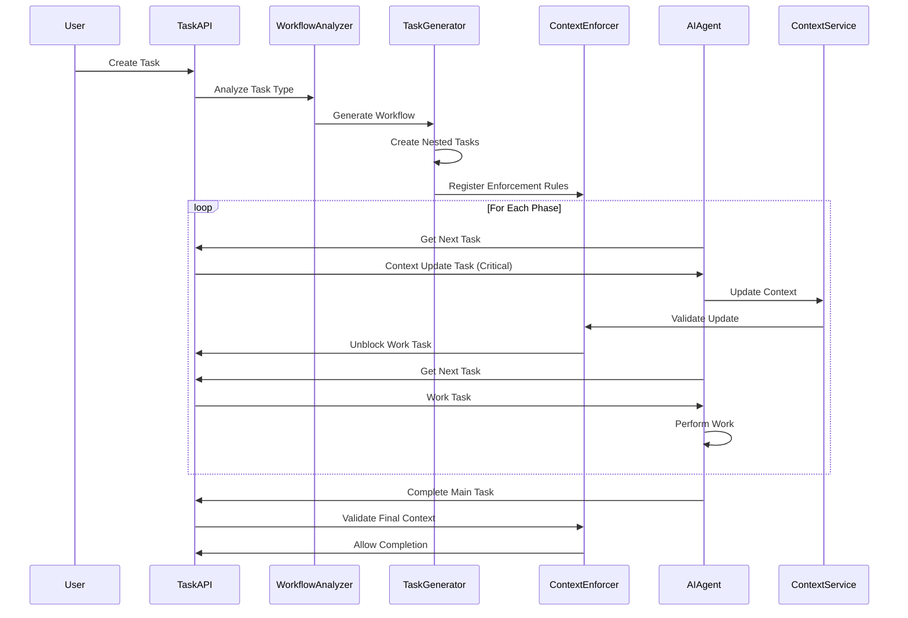

# Automatic Nested Task System Architecture

## Overview

This document presents the architectural design for an automatic nested task system that enforces context updates at each workflow step through high-priority micro-tasks. The system ensures AI agents cannot proceed without updating context, transforming context management from optional to mandatory.

## Problem Statement

Current AI workflow allows agents to:
- Complete multiple steps without context updates
- Forget to document progress
- Skip context synchronization
- Complete tasks with outdated context

This leads to:
- Lost work history
- Incomplete documentation
- Poor knowledge transfer
- Difficulty in debugging AI actions

## Solution Architecture

### Core Concept: Workflow Decomposition with Mandatory Checkpoints

```
Main Task
├── Step 1: Analysis Phase
│   ├── Context Update Task (HIGH PRIORITY, BLOCKING)
│   └── Analysis Work Task
├── Step 2: Implementation Phase  
│   ├── Context Update Task (HIGH PRIORITY, BLOCKING)
│   └── Implementation Work Task
├── Step 3: Testing Phase
│   ├── Context Update Task (HIGH PRIORITY, BLOCKING)  
│   └── Testing Work Task
└── Step 4: Completion
    ├── Final Context Update (MANDATORY)
    └── Task Completion
```

## System Architecture Diagram

```mermaid
graph TB
    %% Main Components
    A[Task Creation] --> B[Workflow Analyzer]
    B --> C[Step Decomposer]
    C --> D[Nested Task Generator]
    
    %% Nested Task Creation
    D --> E[Main Task]
    E --> F1[Step 1: Analysis]
    E --> F2[Step 2: Implementation]
    E --> F3[Step 3: Testing]
    E --> F4[Step 4: Completion]
    
    %% Context Enforcement
    F1 --> G1[Context Update Task<br/>Priority: CRITICAL]
    F1 --> H1[Analysis Work Task<br/>Priority: HIGH]
    G1 -.->|Blocks| H1
    
    F2 --> G2[Context Update Task<br/>Priority: CRITICAL]
    F2 --> H2[Implementation Task<br/>Priority: HIGH]
    G2 -.->|Blocks| H2
    
    F3 --> G3[Context Update Task<br/>Priority: CRITICAL]
    F3 --> H3[Testing Work Task<br/>Priority: HIGH]
    G3 -.->|Blocks| H3
    
    F4 --> G4[Final Context Update<br/>Priority: MANDATORY]
    F4 --> H4[Complete Task]
    G4 -.->|Blocks| H4
    
    %% Monitoring
    I[Context Monitor] --> J[Enforcement Engine]
    J --> K[Block/Unblock Logic]
    K -.->|Controls| H1
    K -.->|Controls| H2
    K -.->|Controls| H3
    K -.->|Controls| H4
    
    %% Feedback Loop
    H1 --> L[Progress Tracker]
    H2 --> L
    H3 --> L
    H4 --> L
    L --> M[Auto Context Extractor]
    M --> N[Context Service]
    
    style G1 fill:#ff6b6b,stroke:#c92a2a,stroke-width:3px
    style G2 fill:#ff6b6b,stroke:#c92a2a,stroke-width:3px
    style G3 fill:#ff6b6b,stroke:#c92a2a,stroke-width:3px
    style G4 fill:#ff6b6b,stroke:#c92a2a,stroke-width:3px
    style J fill:#4c6ef5,stroke:#364fc7,stroke-width:2px
```



## Component Architecture

### 1. Workflow Analyzer

```python
class WorkflowAnalyzer:
    """Analyzes tasks to determine workflow phases"""
    
    def analyze_task(self, task: Task) -> WorkflowPhases:
        """
        Identifies workflow phases based on:
        - Task type (feature, bug, refactor)
        - Complexity estimation
        - Domain (frontend, backend, infrastructure)
        """
        phases = []
        
        # Standard phases for most tasks
        if task.requires_analysis:
            phases.append(WorkflowPhase.ANALYSIS)
        
        if task.requires_implementation:
            phases.append(WorkflowPhase.IMPLEMENTATION)
            
        if task.requires_testing:
            phases.append(WorkflowPhase.TESTING)
            
        phases.append(WorkflowPhase.COMPLETION)
        
        return WorkflowPhases(phases)
```

### 2. Step Decomposer

```python
class StepDecomposer:
    """Decomposes workflow into atomic steps with context requirements"""
    
    def decompose_phase(self, phase: WorkflowPhase, task: Task) -> List[WorkStep]:
        """
        Creates atomic steps for each phase:
        - Each step has clear objectives
        - Each step requires context update
        - Steps are ordered by dependency
        """
        steps = []
        
        if phase == WorkflowPhase.ANALYSIS:
            steps.extend([
                WorkStep(
                    name="Review Requirements",
                    context_required=["requirements_understood", "questions_identified"],
                    estimated_time="15min"
                ),
                WorkStep(
                    name="Analyze Codebase",
                    context_required=["relevant_files", "patterns_identified"],
                    estimated_time="30min"
                )
            ])
            
        return steps
```

### 3. Nested Task Generator

```python
class NestedTaskGenerator:
    """Generates nested task hierarchy with enforcement"""
    
    def generate_nested_tasks(self, main_task: Task, workflow: Workflow) -> TaskHierarchy:
        """
        Creates nested task structure:
        1. Main task container
        2. Phase subtasks
        3. Context update tasks (blocking)
        4. Work tasks (blocked until context updated)
        """
        
        subtasks = []
        
        for phase in workflow.phases:
            # Create phase container
            phase_task = self.create_phase_task(phase, main_task)
            
            # Create context update task (HIGH PRIORITY)
            context_task = self.create_context_task(
                phase=phase,
                priority=Priority.CRITICAL,
                blocking=True,
                auto_extract=True
            )
            
            # Create work task (blocked by context)
            work_task = self.create_work_task(
                phase=phase,
                priority=Priority.HIGH,
                dependencies=[context_task.id]
            )
            
            phase_task.add_subtasks([context_task, work_task])
            subtasks.append(phase_task)
            
        return TaskHierarchy(main_task, subtasks)
```

## Data Models

### Task Hierarchy Schema

```yaml
TaskHierarchy:
  main_task:
    id: uuid
    title: string
    type: enum[feature|bug|refactor|research]
    workflow_phases: Phase[]
    auto_decompose: boolean
    context_enforcement_level: enum[strict|normal|relaxed]
    
  phases:
    - phase_id: uuid
      name: string
      order: integer
      subtasks:
        - context_update_task:
            id: uuid
            type: "context_update"
            priority: "critical"
            blocking: true
            auto_trigger: true
            required_fields:
              - progress_summary
              - key_decisions
              - blockers_found
              - next_steps
            validation_rules:
              - min_length: 50
              - must_reference_work
              
        - work_task:
            id: uuid
            type: "work"
            priority: "high"
            blocked_by: [context_update_task_id]
            estimated_duration: string
            success_criteria: []
```

### Context Update Task Schema

```yaml
ContextUpdateTask:
  metadata:
    task_id: uuid
    parent_task_id: uuid
    phase: enum[analysis|design|implementation|testing|review|completion]
    priority: "critical"
    auto_generated: true
    
  requirements:
    mandatory_fields:
      - what_i_did: string(min=50)
      - key_findings: string[]
      - decisions_made: Decision[]
      - progress_percentage: integer
      
    optional_fields:
      - blockers_encountered: Blocker[]
      - help_needed: string[]
      - patterns_discovered: Pattern[]
      
  enforcement:
    block_next_task: true
    auto_reminder_after: 15_minutes
    escalation_after: 30_minutes
    
  automation:
    pre_populate_from:
      - recent_tool_calls
      - file_modifications
      - test_results
    suggest_content: true
    validate_before_submit: true
```

### Workflow Phase Schema

```yaml
WorkflowPhase:
  standard_phases:
    - ANALYSIS:
        typical_duration: "30-60min"
        context_focus: ["requirements", "approach", "risks"]
        
    - DESIGN:
        typical_duration: "30-45min"
        context_focus: ["architecture", "interfaces", "patterns"]
        
    - IMPLEMENTATION:
        typical_duration: "1-4hrs"
        context_focus: ["code_changes", "decisions", "challenges"]
        
    - TESTING:
        typical_duration: "30-60min"
        context_focus: ["test_coverage", "results", "issues"]
        
    - REVIEW:
        typical_duration: "15-30min"
        context_focus: ["feedback", "improvements", "approval"]
        
    - COMPLETION:
        typical_duration: "15min"
        context_focus: ["summary", "outcomes", "next_steps"]
```

## Implementation Architecture

### System Components Interaction



### Enforcement Engine

```python
class ContextEnforcementEngine:
    """Enforces context update requirements"""
    
    def __init__(self):
        self.blocked_tasks = {}
        self.context_requirements = {}
        self.escalation_queue = []
        
    def register_enforcement(self, work_task_id: str, context_task_id: str):
        """Register that work_task is blocked by context_task"""
        self.blocked_tasks[work_task_id] = {
            'blocked_by': context_task_id,
            'registered_at': datetime.utcnow(),
            'escalation_level': 0
        }
        
    def check_task_access(self, task_id: str, agent_id: str) -> AccessDecision:
        """Check if agent can access task"""
        if task_id in self.blocked_tasks:
            blocker = self.blocked_tasks[task_id]
            
            # Check if blocking task is completed
            if not self.is_context_updated(blocker['blocked_by']):
                return AccessDecision(
                    allowed=False,
                    reason="Context update required",
                    blocking_task=blocker['blocked_by'],
                    suggestion="Complete context update task first"
                )
                
        return AccessDecision(allowed=True)
        
    def escalate_overdue_updates(self):
        """Escalate context updates that are overdue"""
        now = datetime.utcnow()
        
        for task_id, info in self.blocked_tasks.items():
            time_blocked = now - info['registered_at']
            
            if time_blocked > timedelta(minutes=30) and info['escalation_level'] == 0:
                self.escalate_to_high_priority(info['blocked_by'])
                info['escalation_level'] = 1
                
            elif time_blocked > timedelta(hours=1) and info['escalation_level'] == 1:
                self.escalate_to_critical(info['blocked_by'])
                info['escalation_level'] = 2
```

### Auto-Population Service

```python
class ContextAutoPopulator:
    """Pre-populates context updates with extracted information"""
    
    def prepare_context_update(self, task_id: str, phase: str) -> ContextDraft:
        """
        Prepares draft context update by:
        1. Analyzing recent AI actions
        2. Extracting relevant information
        3. Formatting as context update
        """
        
        # Get recent actions
        recent_actions = self.get_recent_actions(task_id)
        
        # Extract context
        draft = ContextDraft()
        
        # What was done
        draft.what_i_did = self.summarize_actions(recent_actions)
        
        # Key findings from searches/analysis
        draft.key_findings = self.extract_findings(recent_actions)
        
        # Decisions from code changes
        draft.decisions_made = self.extract_decisions(recent_actions)
        
        # Progress estimation
        draft.progress_percentage = self.estimate_progress(phase, recent_actions)
        
        # Detected blockers
        draft.blockers = self.detect_blockers(recent_actions)
        
        return draft
```

## Configuration

```yaml
# automatic_nested_tasks_config.yaml

nested_task_system:
  enabled: true
  
  workflow_analysis:
    auto_detect_phases: true
    standard_workflows:
      feature:
        phases: [analysis, design, implementation, testing, review, completion]
      bugfix:
        phases: [analysis, implementation, testing, completion]
      refactor:
        phases: [analysis, implementation, testing, review, completion]
        
  context_enforcement:
    level: strict  # strict|normal|relaxed
    
    blocking_rules:
      strict:
        block_work_until_context: true
        require_all_fields: true
        min_update_length: 100
        
      normal:
        block_work_until_context: true
        require_mandatory_fields: true
        min_update_length: 50
        
      relaxed:
        block_work_until_context: false
        require_basic_fields: true
        min_update_length: 20
        
  auto_population:
    enabled: true
    sources:
      - recent_tool_calls
      - file_modifications
      - test_executions
      - error_logs
      
  escalation:
    reminder_intervals:
      - after_minutes: 15
        action: gentle_reminder
      - after_minutes: 30
        action: increase_priority
      - after_minutes: 60
        action: critical_alert
```

## Benefits

### For AI Agents
1. **Clear Workflow Structure**: Always know what to do next
2. **Reduced Cognitive Load**: Context updates are guided and pre-populated
3. **Better Memory**: Can't forget to update context
4. **Quality Assurance**: Work validated at each phase

### For Human Users
1. **Complete Visibility**: See progress at each step
2. **Rich Documentation**: Context captured throughout workflow
3. **Better Handoffs**: Clear state at any point
4. **Audit Trail**: Complete history of decisions and actions

### For System
1. **Data Quality**: Consistent, timely context updates
2. **Workflow Optimization**: Learn from phase patterns
3. **Predictive Analytics**: Understand task progression
4. **Resource Planning**: Better effort estimation

## Migration Strategy

### Phase 1: Pilot (Week 1-2)
- Enable for new tasks only
- Monitor adoption and feedback
- Tune auto-population accuracy

### Phase 2: Rollout (Week 3-4)
- Enable for all task types
- Provide opt-out mechanism
- Refine enforcement levels

### Phase 3: Optimization (Week 5-6)
- Analyze workflow patterns
- Optimize phase detection
- Enhance auto-population

### Phase 4: Full Integration (Week 7-8)
- Remove opt-out option
- Integrate with reporting
- Add predictive features

## Sync Enforcement Integration

### Context Task with Mandatory Sync

```python
class SyncEnforcedContextTask:
    """Context update task with built-in sync enforcement"""
    
    def __init__(self, task_id: str, phase: str):
        self.task_id = task_id
        self.phase = phase
        self.sync_client = MandatorySyncClient()
        self.journal = LocalChangeJournal()
        
    async def execute(self):
        """Execute context update with mandatory sync"""
        
        # 1. Pull latest context (mandatory)
        try:
            latest_context = await self.sync_client.pull_latest()
            if not latest_context:
                raise SyncError("Cannot proceed without latest context")
        except SyncError as e:
            # Block task execution
            return TaskResult(
                status="blocked",
                reason="Cannot sync with cloud MCP server",
                retry_after=300  # 5 minutes
            )
        
        # 2. Auto-populate from recent actions
        draft_update = self.auto_populate_context()
        
        # 3. Present to AI for completion
        final_update = await self.get_ai_input(draft_update)
        
        # 4. Push update (with fail-safe)
        sync_result = await self.safe_push_update(final_update)
        
        if not sync_result.success:
            # Save to journal but allow completion
            self.journal.append(final_update)
            return TaskResult(
                status="completed_with_warning",
                warning="Context saved locally, will sync when possible"
            )
            
        return TaskResult(status="completed")
        
    async def safe_push_update(self, update: dict):
        """Push with retry and fail-safe"""
        for attempt in range(3):
            try:
                return await self.sync_client.push_context_update(update)
            except Exception as e:
                if attempt == 2:
                    # Final attempt failed
                    return SyncResult(success=False, error=str(e))
                await asyncio.sleep(2 ** attempt)  # Exponential backoff
```

### Workflow with Sync Points

```yaml
sync_enforced_workflow:
  phases:
    - name: "Analysis"
      tasks:
        - sync_pull_task:
            type: "mandatory_sync"
            action: "pull_latest_context"
            priority: "critical"
            blocking: true
            
        - context_update_task:
            type: "context_update"
            priority: "critical"
            sync_on_complete: true
            fail_safe_journal: true
            
        - analysis_work_task:
            type: "work"
            blocked_by: ["sync_pull_task", "context_update_task"]
            
    - name: "Implementation"
      sync_checkpoint:
        interval: 300  # 5 minutes
        auto_sync: true
        visual_indicator: true
```

### Nested Task Sync Visualization

```
Main Task [Context: 🔴 Stale]
│
├── Phase 1: Analysis
│   ├── 🔄 Sync Pull Task (BLOCKING)
│   │   └── Status: ✅ Synced
│   ├── 📝 Context Update Task (CRITICAL)
│   │   ├── Auto-populated: ✅
│   │   ├── AI completed: ✅
│   │   └── Sync status: ✅ Pushed
│   └── 💼 Analysis Work
│       └── [Context: ✅ Fresh]
│
├── Phase 2: Implementation [Context: 🟡 Recent]
│   ├── 🔄 Auto-sync checkpoint
│   ├── 📝 Context Update Task
│   │   └── Sync status: ⏳ Pending (in journal)
│   └── 💼 Implementation Work
│
└── Phase 3: Completion [Context: 🔴 Needs sync]
    ├── 🔄 Final sync (MANDATORY)
    ├── 📝 Completion summary
    └── ✅ Task complete
```

### Sync-Aware Task Blocking

```python
class SyncAwareTaskBlocker:
    """Blocks tasks based on sync state"""
    
    def can_access_task(self, task: Task, sync_state: SyncState) -> AccessDecision:
        """Determine if task can be accessed based on sync state"""
        
        # Critical tasks require fresh sync
        if task.priority == Priority.CRITICAL:
            if sync_state.minutes_since_sync > 5:
                return AccessDecision(
                    allowed=False,
                    reason="Critical task requires fresh context sync",
                    required_action="sync_pull",
                    retry_after=0  # Immediate retry after sync
                )
                
        # Normal tasks allow recent sync
        elif task.priority == Priority.HIGH:
            if sync_state.minutes_since_sync > 15:
                return AccessDecision(
                    allowed=False,
                    reason="Task requires recent context (< 15 min)",
                    required_action="sync_pull"
                )
                
        # Context updates always require sync
        if task.type == TaskType.CONTEXT_UPDATE:
            if sync_state.status != SyncStatus.SYNCED:
                return AccessDecision(
                    allowed=False,
                    reason="Context updates require successful sync",
                    required_action="sync_retry"
                )
                
        return AccessDecision(allowed=True)
```

### Configuration with Sync Enforcement

```yaml
nested_task_sync_config:
  enforcement_levels:
    strict:
      require_sync_before_phase: true
      max_stale_minutes: 5
      block_on_sync_failure: true
      journal_fallback: false
      
    normal:
      require_sync_before_phase: true
      max_stale_minutes: 15
      block_on_sync_failure: false
      journal_fallback: true
      
    relaxed:
      require_sync_before_phase: false
      max_stale_minutes: 30
      block_on_sync_failure: false
      journal_fallback: true
      
  sync_checkpoints:
    - trigger: "phase_start"
      action: "pull_and_validate"
    - trigger: "context_update_complete"
      action: "push_with_retry"
    - trigger: "phase_complete"
      action: "full_sync"
    - trigger: "task_complete"
      action: "final_sync_mandatory"
      
  visual_indicators:
    show_sync_status: true
    update_interval: 60  # seconds
    status_format: "[Phase: {phase} | Context: {sync_status}]"
```

## Enhanced Benefits with Sync

### Reliability
1. **No Lost Updates**: Journal ensures persistence
2. **Always Current**: Mandatory sync at phase boundaries
3. **Graceful Degradation**: Works offline with journal
4. **Conflict Prevention**: Regular sync prevents divergence

### Visibility
1. **Sync Status Awareness**: Visual indicators throughout
2. **Blocked Reason Clarity**: Clear sync requirements
3. **Journal Transparency**: See pending updates
4. **Health Monitoring**: Track sync performance

### Multi-Agent Support
1. **Cross-Agent Awareness**: Regular sync shares context
2. **Conflict Resolution**: Built into sync points
3. **Collaborative Workflows**: Phases sync automatically
4. **Change Propagation**: Updates visible immediately

## Implementation Priority

### Phase 1: Core Integration (Week 1)
- Add sync client to context tasks
- Implement basic pull/push at phase boundaries
- Add journal fallback for failures

### Phase 2: Enhanced Blocking (Week 2)
- Sync-aware task blocking logic
- Visual sync status indicators
- Retry mechanisms with backoff

### Phase 3: Optimization (Week 3)
- Intelligent sync batching
- Predictive pre-fetching
- Performance monitoring

### Phase 4: Advanced Features (Week 4)
- Conflict resolution UI
- Multi-agent coordination
- Sync analytics dashboard

## Conclusion

The automatic nested task system with integrated sync enforcement transforms context management into a reliable, mandatory part of every workflow. By combining:

1. **Nested task structure** - Enforces context updates at each phase
2. **Mandatory sync points** - Ensures cloud synchronization
3. **Fail-safe mechanisms** - Local journal prevents data loss
4. **Visual feedback** - Constant sync status awareness

We create a system where AI agents literally cannot forget to update or sync context. The architecture provides the foundation for truly reliable multi-agent collaboration in cloud-based MCP environments, ensuring that context is always current, always synced, and never lost.