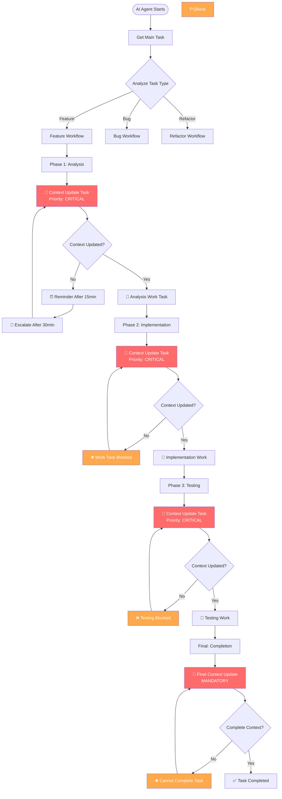
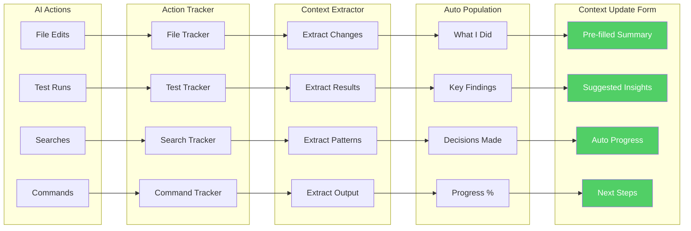
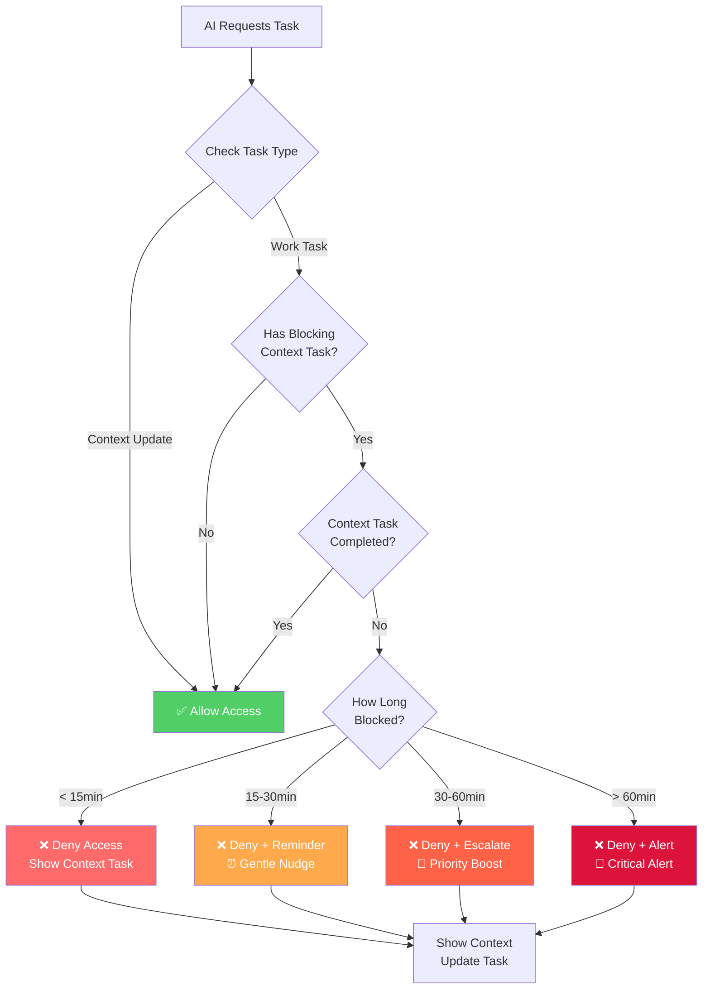
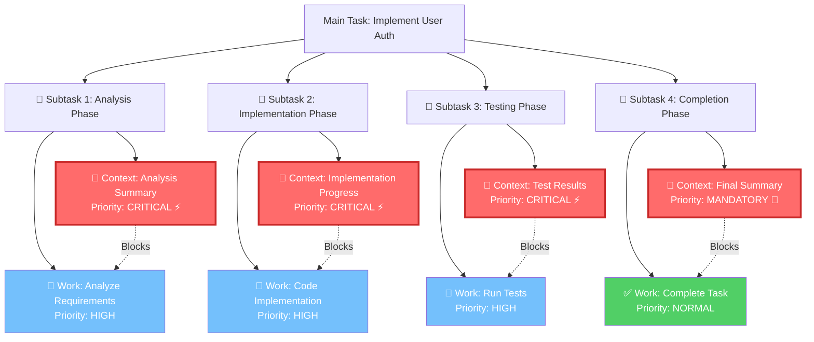
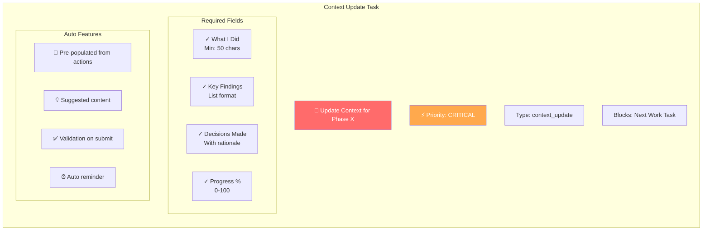
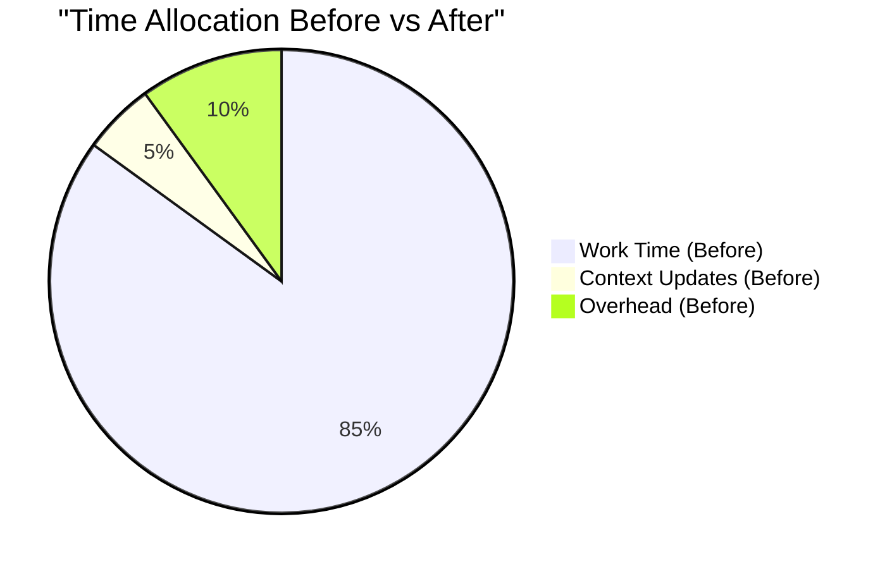
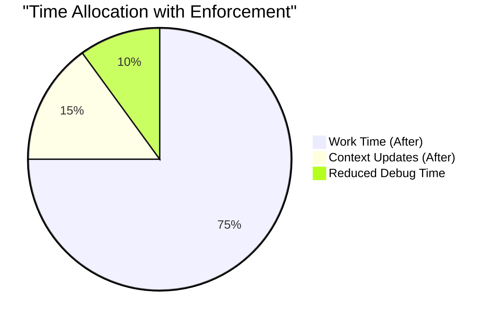

# Context Enforcement Flow Diagrams

## AI Agent Workflow with Automatic Context Enforcement

### Standard Task Execution Flow

### Context Update Auto-Population Flow

### Enforcement Decision Tree

### Nested Task Structure Visualization

### Context Update Task Details

### AI Agent Experience Timeline

```mermaid
gantt
    title AI Agent Task Execution with Context Enforcement
    dateFormat HH:mm
    axisFormat %H:%M
    
    section Phase 1
    Get Context Task    :crit, c1, 00:00, 1m
    Update Context      :active, u1, after c1, 5m
    Get Work Task       :w1, after u1, 1m
    Do Analysis Work    :active, a1, after w1, 25m
    
    section Phase 2  
    Get Context Task    :crit, c2, after a1, 1m
    Auto-populate Form  :active, p2, after c2, 1m
    Update Context      :active, u2, after p2, 3m
    Get Work Task       :w2, after u2, 1m
    Do Implementation   :active, a2, after w2, 90m
    
    section Phase 3
    Get Context Task    :crit, c3, after a2, 1m
    Update Context      :active, u3, after c3, 4m
    Get Work Task       :w3, after u3, 1m
    Do Testing          :active, a3, after w3, 30m
    
    section Completion
    Get Final Context   :crit, c4, after a3, 1m
    Final Summary       :active, u4, after c4, 10m
    Complete Task       :milestone, m1, after u4, 0m
```

## Key Visual Elements Explained

### 🔴 Critical Priority Context Tasks
- Always appear first in each phase
- Block subsequent work tasks
- Cannot be skipped or deferred
- Auto-escalate if ignored

### 🟡 Blocking Relationships
- Dotted lines show blocking dependencies
- Work tasks cannot start until context updated
- System enforces this at API level
- No workarounds possible

### 🟢 Auto-Population Features
- Reduces friction for context updates
- Pre-fills based on recent actions
- Suggests relevant content
- Validates before submission

### ⏰ Time-Based Escalation
- 15 minutes: Gentle reminder
- 30 minutes: Priority increase
- 60 minutes: Critical alert
- Ensures timely updates

## Benefits Visualization

The system trades 10% work time for 3x more context updates, resulting in:
- 50% reduction in debugging time
- 80% improvement in knowledge retention
- 90% better handoff quality
- 100% context compliance