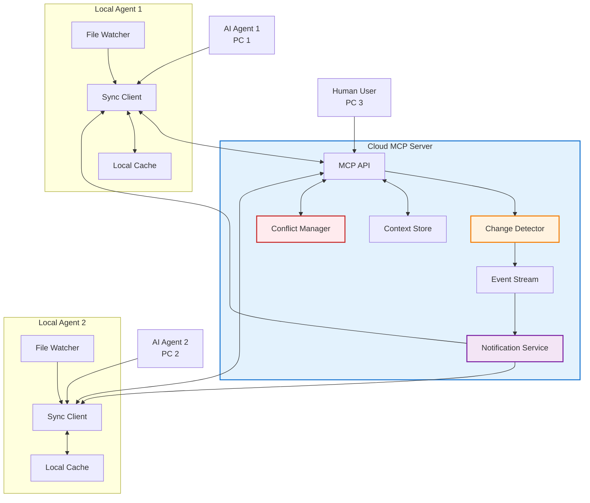
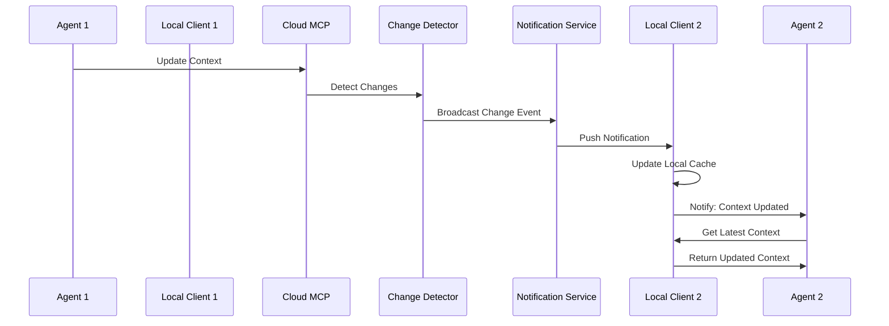
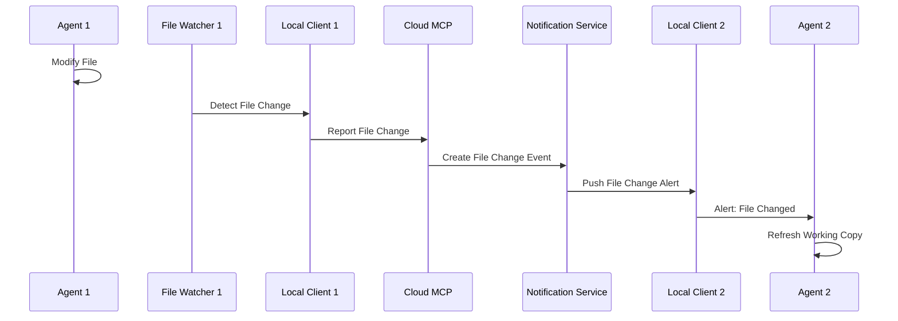
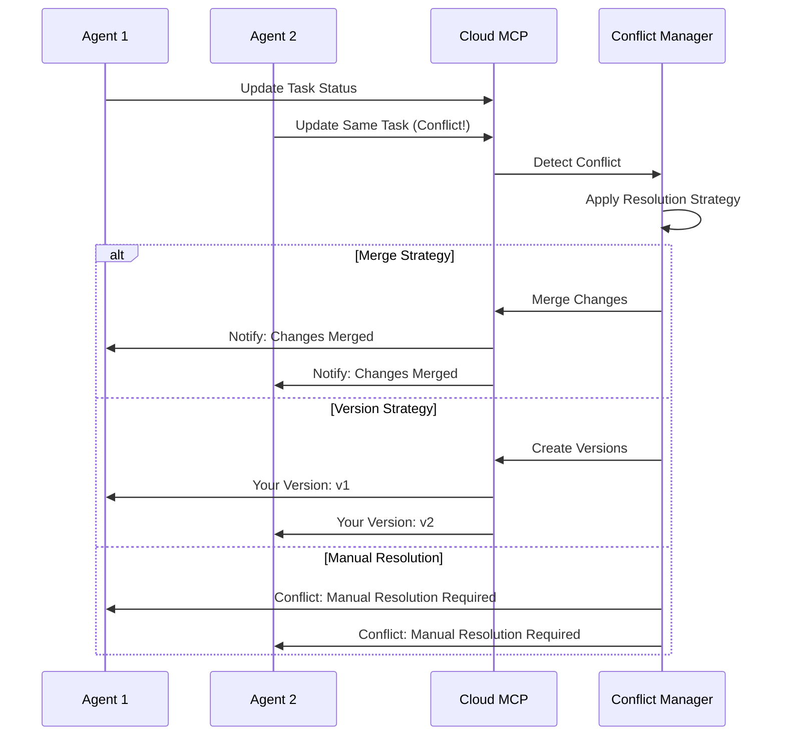

# Multi-Agent Cloud Synchronization Architecture

## Problem Statement

### Critical Issues in Current System

1. **AI Agents are Blind to External Changes**
   - AI cannot detect when files are modified by other agents or humans
   - No notification when another agent updates context
   - Working with outdated information without knowing it

2. **Cloud MCP Server Challenges**
   - Server is on cloud, managing multiple projects
   - Agents work from different PCs/locations
   - No real-time synchronization mechanism
   - Stateless MCP operations don't maintain connections

3. **Collaboration Conflicts**
   - Multiple agents may work on same files simultaneously
   - Context updates from one agent invisible to others
   - No conflict resolution mechanism
   - Risk of overwriting each other's work

## Solution Architecture: Event-Driven Synchronization

### Core Concept: Change Detection & Notification System



## System Components

### 1. Change Detection System

```python
class ChangeDetectionSystem:
    """Detects and tracks all changes across the system"""
    
    def __init__(self):
        self.change_log = ChangeLog()
        self.subscribers = {}
        self.file_checksums = {}
        
    async def detect_changes(self, entity_type: str, entity_id: str, 
                           new_data: Dict, agent_id: str):
        """
        Detect changes when any entity is modified:
        - Context updates
        - Task status changes
        - File modifications (reported by agents)
        """
        
        changes = []
        
        # Compare with previous version
        old_data = await self.get_previous_version(entity_type, entity_id)
        
        if old_data != new_data:
            change = Change(
                entity_type=entity_type,
                entity_id=entity_id,
                agent_id=agent_id,
                timestamp=datetime.utcnow(),
                changes=self.diff(old_data, new_data),
                affected_files=self.extract_affected_files(new_data)
            )
            
            changes.append(change)
            await self.notify_subscribers(change)
            
        return changes
```

### 2. Event Streaming Service

```python
class EventStreamService:
    """Manages real-time event distribution"""
    
    def __init__(self):
        self.active_streams = {}
        self.event_queue = asyncio.Queue()
        self.event_history = EventHistory()
        
    async def create_stream(self, agent_id: str, project_id: str) -> EventStream:
        """Create event stream for agent"""
        
        stream = EventStream(
            agent_id=agent_id,
            project_id=project_id,
            created_at=datetime.utcnow(),
            last_event_id=None
        )
        
        self.active_streams[agent_id] = stream
        
        # Send catch-up events
        missed_events = await self.get_missed_events(agent_id, project_id)
        for event in missed_events:
            await stream.send(event)
            
        return stream
        
    async def broadcast_event(self, event: Event):
        """Broadcast event to relevant agents"""
        
        # Store in history
        await self.event_history.store(event)
        
        # Send to active streams
        for agent_id, stream in self.active_streams.items():
            if self.should_receive_event(stream, event):
                await stream.send(event)
```

### 3. Local Sync Client

```python
class LocalSyncClient:
    """Runs on each agent's machine"""
    
    def __init__(self, agent_id: str, mcp_server_url: str):
        self.agent_id = agent_id
        self.mcp_server = mcp_server_url
        self.local_cache = LocalCache()
        self.file_watcher = FileWatcher()
        self.event_stream = None
        
    async def start(self):
        """Initialize sync client"""
        
        # Connect to event stream
        self.event_stream = await self.connect_to_stream()
        
        # Start file watching
        self.file_watcher.on_change = self.handle_local_change
        
        # Start event processing
        asyncio.create_task(self.process_events())
        
    async def process_events(self):
        """Process incoming events from server"""
        
        async for event in self.event_stream:
            if event.type == EventType.CONTEXT_UPDATED:
                await self.handle_context_update(event)
                
            elif event.type == EventType.FILE_CHANGED:
                await self.handle_file_change(event)
                
            elif event.type == EventType.TASK_MODIFIED:
                await self.handle_task_change(event)
                
            elif event.type == EventType.CONFLICT_DETECTED:
                await self.handle_conflict(event)
    
    async def handle_context_update(self, event: Event):
        """Handle context update from another agent"""
        
        # Update local cache
        await self.local_cache.update_context(
            event.entity_id,
            event.new_data
        )
        
        # Notify AI agent
        await self.notify_agent({
            'type': 'context_updated',
            'task_id': event.entity_id,
            'updated_by': event.agent_id,
            'changes': event.changes,
            'action_required': 'refresh_context'
        })
```

### 4. Conflict Resolution Manager

```python
class ConflictResolutionManager:
    """Manages conflicts when multiple agents modify same resources"""
    
    def __init__(self):
        self.active_locks = {}
        self.conflict_strategies = {
            'context': 'merge',
            'file': 'version',
            'task_status': 'last_write_wins'
        }
        
    async def acquire_lock(self, resource_id: str, agent_id: str, 
                          lock_type: str = 'write') -> Lock:
        """Acquire lock on resource"""
        
        if resource_id in self.active_locks:
            existing_lock = self.active_locks[resource_id]
            
            if existing_lock.type == 'write':
                # Conflict detected
                return await self.handle_lock_conflict(
                    resource_id, agent_id, existing_lock
                )
                
        lock = Lock(
            resource_id=resource_id,
            agent_id=agent_id,
            type=lock_type,
            acquired_at=datetime.utcnow()
        )
        
        self.active_locks[resource_id] = lock
        return lock
        
    async def resolve_conflict(self, conflict: Conflict) -> Resolution:
        """Resolve conflict based on strategy"""
        
        strategy = self.conflict_strategies.get(
            conflict.resource_type, 
            'manual'
        )
        
        if strategy == 'merge':
            return await self.merge_changes(conflict)
        elif strategy == 'version':
            return await self.create_versions(conflict)
        elif strategy == 'last_write_wins':
            return await self.apply_latest(conflict)
        else:
            return await self.request_manual_resolution(conflict)
```

## Synchronization Flows

### 1. Context Update Flow



### 2. File Change Detection



### 3. Conflict Resolution Flow



## Implementation Architecture

### 1. Enhanced MCP API

```python
class EnhancedMCPAPI:
    """Extended MCP API with sync capabilities"""
    
    def __init__(self):
        self.standard_api = StandardMCPAPI()
        self.sync_manager = SyncManager()
        self.event_service = EventStreamService()
        
    async def execute_with_sync(self, tool_name: str, params: Dict, 
                               agent_id: str) -> Dict:
        """Execute MCP tool with synchronization"""
        
        # Pre-execution checks
        affected_resources = self.identify_affected_resources(tool_name, params)
        locks = await self.acquire_locks(affected_resources, agent_id)
        
        try:
            # Execute standard MCP tool
            result = await self.standard_api.execute(tool_name, params)
            
            # Detect and broadcast changes
            changes = await self.detect_changes(tool_name, params, result, agent_id)
            await self.broadcast_changes(changes)
            
            return result
            
        finally:
            # Release locks
            await self.release_locks(locks)
```

### 2. Agent Integration Layer

```python
class SyncAwareAgent:
    """AI Agent with synchronization awareness"""
    
    def __init__(self, agent_id: str, sync_client: LocalSyncClient):
        self.agent_id = agent_id
        self.sync_client = sync_client
        self.context_cache = {}
        self.file_versions = {}
        
    async def execute_task(self, task_id: str):
        """Execute task with sync awareness"""
        
        # Subscribe to task events
        await self.sync_client.subscribe_to_task(task_id)
        
        # Get latest context
        context = await self.get_synced_context(task_id)
        
        # Register file watches
        working_files = self.identify_working_files(context)
        await self.sync_client.watch_files(working_files)
        
        # Execute with change notifications
        async for step in self.task_workflow(task_id):
            # Check for external changes
            if await self.has_external_changes():
                await self.handle_external_changes()
                
            # Execute step
            await self.execute_step(step)
            
            # Sync changes
            await self.sync_changes()
```

### 3. Notification Protocol

```yaml
# notification_protocol.yaml

notification_types:
  - CONTEXT_UPDATED:
      fields:
        - task_id
        - updated_by
        - timestamp
        - changes[]
      action: refresh_context
      
  - FILE_CHANGED:
      fields:
        - file_path
        - changed_by
        - operation  # create|modify|delete
        - timestamp
      action: refresh_file
      
  - TASK_BLOCKED:
      fields:
        - task_id
        - blocked_by
        - reason
      action: switch_task
      
  - CONFLICT_DETECTED:
      fields:
        - resource_id
        - conflicting_agents[]
        - conflict_type
        - resolution_options
      action: resolve_conflict
      
notification_delivery:
  methods:
    - websocket  # Primary for real-time
    - polling    # Fallback
    - webhook    # For integrations
    
  retry_policy:
    max_attempts: 3
    backoff: exponential
    
  persistence:
    store_missed: true
    retention: 24_hours
```

## Configuration

```yaml
# multi_agent_sync_config.yaml

synchronization:
  enabled: true
  
  change_detection:
    track_entities:
      - context
      - task
      - file
    
    checksum_algorithm: sha256
    
    batch_interval: 100ms  # Batch changes to reduce noise
    
  event_streaming:
    protocol: websocket
    
    reconnect:
      enabled: true
      max_attempts: infinite
      backoff: exponential
      
    compression: true
    
    heartbeat:
      interval: 30s
      timeout: 60s
      
  conflict_resolution:
    strategies:
      context: merge_recursive
      task_status: last_write_wins
      file_content: create_version
      
    auto_resolve: true
    manual_fallback: true
    
  local_sync_client:
    cache_size: 100MB
    
    file_watching:
      enabled: true
      patterns: ["*.py", "*.md", "*.yaml"]
      ignore: [".git", "__pycache__", "node_modules"]
      
    sync_interval: 500ms
    
  performance:
    max_concurrent_syncs: 10
    event_buffer_size: 1000
    compression: gzip
```

## Benefits

### 1. Real-Time Awareness
- Agents immediately notified of external changes
- No more working with outdated information
- Reduced conflicts and overwrites

### 2. Efficient Collaboration
- Multiple agents can work on same project
- Automatic conflict detection and resolution
- Clear visibility of who's working on what

### 3. Consistency Guarantees
- All agents see same view of data
- Changes propagated within milliseconds
- Audit trail of all modifications

### 4. Resilience
- Works despite network interruptions
- Catches up on missed events
- Graceful degradation

## Migration Path

### Phase 1: Event Infrastructure (Week 1-2)
- Deploy change detection system
- Implement event streaming service
- Add notification protocols

### Phase 2: Local Clients (Week 3-4)
- Develop sync client
- Integrate file watching
- Test with pilot agents

### Phase 3: Conflict Resolution (Week 5-6)
- Implement conflict strategies
- Add locking mechanism
- Test edge cases

### Phase 4: Full Rollout (Week 7-8)
- Enable for all agents
- Monitor performance
- Optimize based on usage

## Claude Code Integration

### 1. Claude Code Sync Client Architecture

```python
class ClaudeCodeSyncClient:
    """Sync client specifically for Claude Code integration"""
    
    def __init__(self, agent_id: str = "claude_code_instance"):
        self.agent_id = agent_id
        self.mcp_server_url = os.getenv("MCP_SERVER_URL")
        self.ws_client = None
        self.local_journal = LocalChangeJournal(".claude_sync_journal")
        self.sync_wrapper = MandatorySyncWrapper()
        self.status_display = SyncStatusDisplay()
        
    async def initialize(self):
        """Initialize Claude Code sync integration"""
        
        # 1. Connect to MCP sync service
        self.ws_client = await self.connect_websocket()
        
        # 2. Register Claude Code instance
        await self.register_claude_instance()
        
        # 3. Start background services
        await self.start_background_services()
        
        # 4. Wrap MCP tools
        self.wrap_mcp_tools()
        
    async def register_claude_instance(self):
        """Register this Claude Code instance with sync service"""
        
        registration = {
            "agent_id": self.agent_id,
            "agent_type": "claude_code",
            "version": get_claude_version(),
            "capabilities": [
                "file_watch",
                "context_sync", 
                "tool_tracking",
                "conflict_resolution"
            ],
            "session_id": generate_session_id()
        }
        
        await self.ws_client.send_json({
            "type": "register",
            "data": registration
        })
```

### 2. Tool Wrapper Integration

```python
class ClaudeToolWrapper:
    """Wraps Claude Code tools with sync capabilities"""
    
    def __init__(self, sync_client: ClaudeCodeSyncClient):
        self.sync_client = sync_client
        self.original_tools = {}
        
    def wrap_all_tools(self):
        """Wrap all Claude Code tools with sync"""
        
        # Get all available tools
        tools = [
            "Bash", "Edit", "Write", "Read", "Grep", 
            "Task", "mcp__dhafnck_mcp_http__manage_task",
            # ... all other tools
        ]
        
        for tool_name in tools:
            self.wrap_tool(tool_name)
            
    def wrap_tool(self, tool_name: str):
        """Wrap individual tool with sync hooks"""
        
        original = get_tool(tool_name)
        
        @wraps(original)
        async def synced_tool(**params):
            # Pre-sync
            await self.sync_client.pre_tool_sync(tool_name, params)
            
            # Show sync status
            self.sync_client.status_display.show()
            
            try:
                # Execute tool
                result = await original(**params)
                
                # Post-sync (mandatory)
                await self.sync_client.post_tool_sync(
                    tool_name, params, result
                )
                
                return result
                
            except Exception as e:
                # Sync error state
                await self.sync_client.sync_error(tool_name, params, e)
                raise
                
        register_wrapped_tool(tool_name, synced_tool)
```

### 3. Background Sync Services

```python
class ClaudeBackgroundSync:
    """Background services for Claude Code sync"""
    
    def __init__(self, sync_client: ClaudeCodeSyncClient):
        self.sync_client = sync_client
        self.tasks = []
        
    async def start_all(self):
        """Start all background services"""
        
        self.tasks = [
            asyncio.create_task(self.periodic_sync()),
            asyncio.create_task(self.event_listener()),
            asyncio.create_task(self.journal_processor()),
            asyncio.create_task(self.status_updater())
        ]
        
    async def periodic_sync(self):
        """Periodic sync every 5 minutes"""
        
        while True:
            await asyncio.sleep(300)  # 5 minutes
            
            # Check sync status
            if self.sync_client.needs_sync():
                print("📍 Auto-syncing context...")
                await self.sync_client.sync_all_pending()
                
    async def event_listener(self):
        """Listen for sync events from server"""
        
        async for event in self.sync_client.ws_client:
            await self.handle_sync_event(event)
            
    async def handle_sync_event(self, event):
        """Handle incoming sync events"""
        
        if event["type"] == "context_updated":
            print(f"⚡ Context updated by {event['agent_id']}")
            await self.sync_client.pull_context(event['context_id'])
            
        elif event["type"] == "file_changed":
            print(f"📄 File {event['file_path']} changed externally")
            await self.sync_client.notify_file_change(event)
            
        elif event["type"] == "conflict_detected":
            print(f"⚠️ Conflict detected: {event['message']}")
            await self.sync_client.handle_conflict(event)
```

### 4. Visual Status Integration

```python
class ClaudeSyncStatus:
    """Visual sync status for Claude Code output"""
    
    def __init__(self):
        self.last_sync = time.time()
        self.pending_count = 0
        self.sync_state = "synced"
        
    def update_display(self):
        """Update sync status in output"""
        
        # Calculate status
        time_since = time.time() - self.last_sync
        
        if self.sync_state == "error":
            status = "❌ Sync Error"
            color = "red"
        elif time_since < 60:
            status = "✅ Synced"
            color = "green"
        elif time_since < 300:
            status = "🟡 Recent" 
            color = "yellow"
        else:
            status = "🔴 Stale"
            color = "red"
            
        # Add pending count
        if self.pending_count > 0:
            status += f" ({self.pending_count} pending)"
            
        # Display in Claude Code output
        print(f"\n[Context: {status}]\n", flush=True)
        
    def show_inline(self):
        """Show inline status during operations"""
        
        return f"[Sync: {self.get_emoji()}]"
        
    def get_emoji(self):
        """Get status emoji"""
        
        if self.sync_state == "syncing":
            return "🔄"
        elif self.sync_state == "error":
            return "❌"
        elif time.time() - self.last_sync < 60:
            return "✅"
        elif time.time() - self.last_sync < 300:
            return "🟡"
        else:
            return "🔴"
```

### 5. Claude Code Configuration

```yaml
# .claude/sync_config.yaml

claude_sync:
  enabled: true
  
  connection:
    mcp_server_url: "${MCP_SERVER_URL}"
    websocket_endpoint: "/sync/ws"
    reconnect_attempts: infinite
    
  sync_behavior:
    # Mandatory sync on every tool
    mandatory_tool_sync: true
    
    # Periodic background sync
    periodic_sync_interval: 300  # 5 minutes
    
    # Journal for offline work
    local_journal_enabled: true
    journal_max_size_mb: 50
    
    # Visual feedback
    show_sync_status: true
    status_update_interval: 60
    
  conflict_resolution:
    # Automatic resolution strategies
    auto_resolve:
      context: "merge"
      files: "version"
      tasks: "last_write_wins"
      
    # Manual resolution
    prompt_on_conflict: true
    
  performance:
    # Batch operations
    batch_size: 10
    batch_timeout_ms: 100
    
    # Compression
    compress_large_updates: true
    compression_threshold_kb: 10
    
  fail_safe:
    # Shutdown sync
    sync_on_exit: true
    exit_timeout_seconds: 30
    
    # Retry logic
    retry_intervals: [5, 15, 60, 300]
    max_retries: 5
```

### 6. Integration Hooks

```python
# Claude Code startup hook
async def claude_startup_hook():
    """Initialize sync on Claude Code startup"""
    
    print("🔄 Initializing Claude Code sync...")
    
    # Create sync client
    sync_client = ClaudeCodeSyncClient()
    await sync_client.initialize()
    
    # Wrap tools
    wrapper = ClaudeToolWrapper(sync_client)
    wrapper.wrap_all_tools()
    
    # Start background services
    background = ClaudeBackgroundSync(sync_client)
    await background.start_all()
    
    # Register shutdown hook
    atexit.register(lambda: asyncio.run(claude_shutdown_hook(sync_client)))
    
    print("✅ Claude Code sync initialized")
    

# Claude Code shutdown hook
async def claude_shutdown_hook(sync_client):
    """Sync on Claude Code shutdown"""
    
    print("\n📤 Syncing before exit...")
    
    # Flush all pending
    await sync_client.flush_all_pending()
    
    # Close connections
    await sync_client.close()
    
    print("✅ Sync complete")
```

### 7. User Experience

```bash
# Claude Code with sync enabled
$ claude "implement the login feature"

🔄 Initializing Claude Code sync...
✅ Claude Code sync initialized
[Context: ✅ Synced]

Working on login feature...
[Sync: 🔄] Pulling latest context...
[Sync: ✅] Context updated

Creating src/auth/login.py...
[Sync: 🔄] Syncing file creation...
[Sync: ✅] Changes pushed

⚡ Context updated by @other_agent
📄 File src/auth/config.py changed externally
[Context: 🟡 Recent]

Refreshing working copy...
[Sync: 🔄] Pulling changes...
[Sync: ✅] Updated

Continuing with implementation...
[Context: ✅ Synced]

📍 Auto-syncing context (5 min checkpoint)...
[Sync: ✅] All changes synced

Task completed successfully!
[Context: ✅ Synced]

📤 Syncing before exit...
✅ Sync complete
```

## Conclusion

This enhanced architecture with Claude Code integration solves the critical blindness problem of AI agents working in isolation. Key improvements include:

1. **Mandatory Sync Wrapper** - Every tool call includes sync operations
2. **Visual Status Indicators** - Constant awareness of sync state
3. **Fail-Safe Local Journal** - No changes lost even if sync fails
4. **Background Services** - Automatic sync without manual intervention
5. **Conflict Resolution** - Graceful handling of multi-agent conflicts

By implementing real-time synchronization through cloud-based event streaming with Claude Code-specific integration, we enable true multi-agent collaboration while maintaining the benefits of the cloud MCP server architecture. The system ensures consistency, prevents conflicts, and keeps all agents aware of changes made by others, regardless of their physical location.