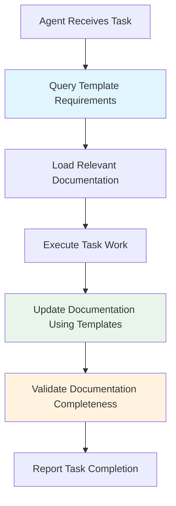
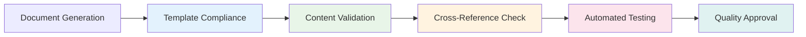

## 🏗️ Architecture Design

### Core Integration Components

**1. Template Engine Service**
```json
{
  "service": "template_engine",
  "mcp_tool": "manage_template",
  "capabilities": [
    "template_selection",
    "variable_resolution", 
    "document_rendering",
    "validation_pipeline",
    "glob_pattern_matching"
  ]
}
```

**2. Enhanced MCP Infrastructure**
- **New Tool**: `manage_template` with actions: select, render, validate, list, update
- **Enhanced Tools**: Augment existing tools with template-aware capabilities
- **Integration Layer**: Seamless connection between templates and existing workflow

**3. Agent Coordination Framework**
- Template-aware task execution
- Cross-agent documentation synchronization
- Automatic update triggers
- Quality validation gates

## 🔧 MCP Tool Enhancements

### New Tool: `manage_template`

```python
Actions:
- select_template(task_context, file_patterns, agent_type) → template_id
- render_template(template_id, variables, output_path) → rendered_document  
- validate_template(document_path, template_id) → validation_result
- list_templates(category, glob_patterns) → available_templates
- update_template_registry(template_metadata) → registry_status
```

### Enhanced Existing Tools

**`manage_task` Enhancements:**
- Add `template_requirements` field to task schema
- Auto-trigger template selection on task creation
- Store document references in task context
- Track documentation status and compliance

**`manage_context` Enhancements:**
- Store template variables hierarchy
- Track document-to-file relationships
- Maintain template rendering history
- Support variable inheritance and resolution

**`manage_project` Enhancements:**
- Project-level template configuration
- Default template assignments by project type
- Template versioning aligned with git branches
- Project-specific variable defaults

## 🎭 Agent Workflow Modifications

### Template-Aware Task Execution



### File Modification Triggers

```python
def on_file_change(file_path):
    # Match against glob patterns
    affected_templates = glob_matcher.find_templates(file_path)
    
    for template in affected_templates:
        # Queue documentation update
        update_task = create_documentation_update_task(
            template_id=template.id,
            file_path=file_path,
            agent=template.preferred_agent
        )
        
        # Notify relevant agents
        notify_agents(update_task)
```

### Cross-Agent Coordination

**Documentation Synchronization Pipeline:**
1. Agent A modifies API endpoint
2. Template system identifies `api_documentation.md` needs update
3. Auto-generates update task with template context
4. Assigns to appropriate agent (documentation_agent or original agent)
5. Validates consistency across related documents

## 🔄 Variable System Implementation

### Variable Context Hierarchy

```yaml
template_variables:
  system:
    timestamp: "{{system.timestamp}}"
    git_branch: "{{system.git_branch}}"
    environment: "{{system.environment}}"
  
  project:
    name: "{{project.name}}"
    id: "{{project.id}}"
    tech_stack: "{{project.tech_stack}}"
  
  task:
    id: "{{task.id}}"
    title: "{{task.title}}"
    assignee: "{{task.assignee}}"
    status: "{{task.status}}"
  
  agent:
    name: "{{agent.name}}"
    type: "{{agent.type}}"
    capabilities: "{{agent.capabilities}}"
  
  file:
    path: "{{file.path}}"
    type: "{{file.type}}"
    related_files: "{{file.related_files}}"
```

### Variable Resolution Engine

```python
class TemplateVariableResolver:
    def resolve_variables(self, template_content, context):
        # Hierarchical context loading
        variables = {
            **self.get_system_context(),
            **self.get_project_context(context.project_id),
            **self.get_task_context(context.task_id),
            **self.get_agent_context(context.agent_id),
            **self.get_file_context(context.file_paths)
        }
        
        return self.render_template(template_content, variables)
```

## 🎯 Automation Triggers

### Automatic Template Operations

**Task Creation Trigger:**
```python
def on_task_created(task):
    # Auto-select appropriate templates
    templates = template_selector.select_by_task_type(task.type)
    
    # Generate initial documentation
    for template in templates:
        render_task_documentation(task, template)
```

**File Modification Trigger:**
```python
def on_file_modified(file_path):
    # Check glob patterns
    affected_docs = glob_matcher.find_affected_documentation(file_path)
    
    # Queue update tasks
    for doc in affected_docs:
        queue_documentation_update(doc, file_path)
```

**Branch Change Trigger:**
```python
def on_branch_changed(new_branch):
    # Update system variables
    update_system_context(git_branch=new_branch)
    
    # Regenerate branch-specific documentation
    regenerate_branch_documentation(new_branch)
```

## ✅ Quality Assurance Framework

### Validation Pipeline



### Quality Metrics

- **Documentation Coverage**: Percentage of files with appropriate documentation
- **Template Compliance**: Adherence to template structure and requirements
- **Freshness Score**: Documentation age vs. code change frequency
- **Cross-Reference Accuracy**: Validity of links and references
- **Agent Quality Rating**: Documentation quality by agent performance

### Automated Testing Integration

```python
def validate_documentation(document_path, template_id):
    results = []
    
    # Test code examples
    if has_code_examples(document_path):
        results.append(test_code_examples(document_path))
    
    # Test API endpoints
    if template_id == "api_documentation":
        results.append(test_api_endpoints(document_path))
    
    # Test component examples
    if template_id == "component_documentation":
        results.append(test_component_examples(document_path))
    
    return ValidationResult(results)
```

## 🚀 Migration Plan

### Phase 1: Foundation (Week 1-2)
- ✅ Implement `manage_template` MCP tool
- ✅ Create template variable resolution engine
- ✅ Set up template registry management
- ✅ Basic template selection and rendering
- ⚠️ **No disruption to existing workflows**

### Phase 2: Core Integration (Week 3-4)
- 🔧 Enhance existing MCP tools with template capabilities
- 🔧 Implement file change detection and glob matching
- 🔧 Add template requirements to task schema
- 🔧 Basic agent workflow integration
- ⚠️ **Parallel operation with existing methods**

### Phase 3: Automation (Week 5-6)
- 🤖 Implement automatic template selection
- 🤖 Add cross-agent coordination for documentation
- 🤖 Integrate quality validation pipeline
- 🤖 File modification triggers
- ⚠️ **Gradual migration of existing documentation**

### Phase 4: Optimization (Week 7-8)
- 📊 Advanced quality metrics and improvements
- ⚡ Performance optimization and caching
- 🎯 Full workflow automation
- ✅ Complete migration from manual documentation
- 👥 **Agent training and adoption**

## 🛡️ Risk Mitigation

**Backward Compatibility:**
- Maintain existing documentation methods during transition
- Gradual feature rollout with fallback capabilities
- Comprehensive testing at each phase

**Quality Assurance:**
- Parallel validation of template vs. manual documentation
- Agent training and gradual adoption
- Rollback capabilities at each migration phase

**Performance Considerations:**
- Template caching and optimization
- Asynchronous documentation updates
- Load balancing for template rendering

## 📋 Implementation Checklist

### Immediate Actions (This Week)
- [ ] Create `manage_template` MCP tool specification
- [ ] Design template variable schema and resolution engine
- [ ] Set up template registry database structure
- [ ] Create basic template selection algorithm

### Short-term Goals (Next 2 Weeks)
- [ ] Implement core template rendering functionality
- [ ] Enhance existing MCP tools with template support
- [ ] Create file change detection system
- [ ] Build glob pattern matching engine

### Medium-term Goals (Next Month)
- [ ] Full agent workflow integration
- [ ] Automated quality validation pipeline
- [ ] Cross-agent coordination system
- [ ] Performance optimization and caching

### Long-term Vision (Next Quarter)
- [ ] Complete migration from manual documentation
- [ ] Advanced analytics and continuous improvement
- [ ] AI-powered template optimization
- [ ] Integration with external documentation systems

This comprehensive strategy ensures seamless integration of your template system into the orchestrational agent workflows while maintaining system stability, quality, and performance. The phased approach minimizes risk while maximizing the benefits of automated, consistent documentation generation.