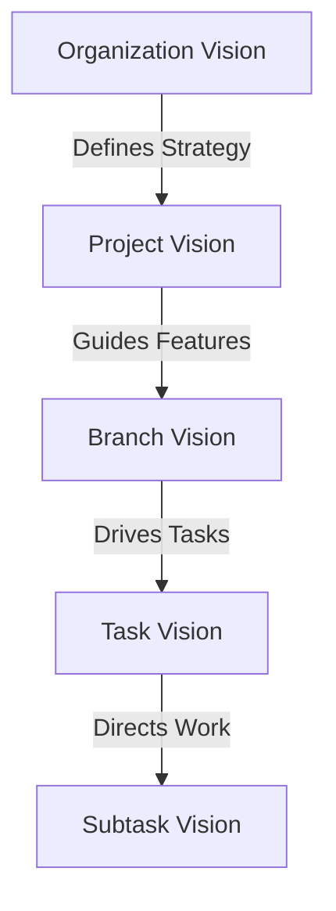

# Vision Hierarchy Architecture

## Overview

The vision hierarchy establishes a clear cascading structure from organizational strategy down to individual task execution. This ensures strategic alignment at every level of work.

## Hierarchy Levels

### 1. Organization Vision (Top Level)

The highest level of vision that defines the overall direction and purpose.

**Key Components:**
- Mission Statement
- Long-term Strategic Goals
- Core Values
- Market Positioning
- Competitive Strategy

**Example:**
```python
class OrganizationVision:
    mission: str = "Transform how teams collaborate on complex projects"
    strategic_goals: List[str] = [
        "Become the leading AI-powered task orchestration platform",
        "Enable 10x productivity improvement for development teams",
        "Foster innovation through intelligent workflow automation"
    ]
    core_values: List[str] = ["Innovation", "Collaboration", "Excellence", "Agility"]
    target_market: str = "Enterprise software development teams"
    competitive_advantage: str = "AI-driven intelligent task orchestration"
```

### 2. Project Vision

Projects inherit from and contribute to the organization vision while defining their specific objectives.

**Key Components:**
- Project Objectives
- Target Audience
- Key Features
- Unique Value Proposition
- Success Metrics
- Strategic Alignment Score

**Structure:**
```python
@dataclass
class ProjectVision:
    # Core Vision Elements
    objectives: List[str]
    target_audience: str
    key_features: List[str]
    unique_value_proposition: str
    competitive_advantages: List[str]
    
    # Measurement
    success_metrics: List[KPI]
    strategic_alignment_score: float  # 0.0 to 1.0
    
    # Strategic Planning
    innovation_priorities: List[str]
    growth_strategy: GrowthStrategy
    risk_factors: List[Risk]
    
    # Validation
    def validate_alignment(self, org_vision: OrganizationVision) -> float:
        """Calculate alignment score with organization vision"""
        pass
```

### 3. Git Branch Vision (Task Tree)

Each branch represents a specific feature or work stream that contributes to the project vision.

**Key Components:**
- Branch Objectives
- Deliverables
- Innovation Priorities
- Risk Assessment
- Alignment with Project Vision

**Structure:**
```python
@dataclass
class BranchVision:
    # Branch-specific Goals
    branch_objectives: List[str]
    branch_deliverables: List[str]
    expected_outcomes: List[str]
    
    # Alignment
    alignment_with_project: float  # 0.0 to 1.0
    contributes_to_objectives: List[str]  # Which project objectives
    
    # Innovation and Risk
    innovation_priorities: List[str]
    technical_approach: str
    risk_factors: List[str]
    mitigation_strategies: List[str]
    
    # Success Criteria
    acceptance_criteria: List[str]
    quality_standards: List[str]
```

### 4. Task Vision

Individual tasks have clear vision alignment showing how they contribute to branch and project goals.

**Key Components:**
- Task Contribution
- Business Value Score
- Strategic Importance
- Success Criteria
- Vision Alignment

**Structure:**
```python
@dataclass
class TaskVisionAlignment:
    # Contribution Mapping
    contributes_to_objectives: List[str]  # Which branch/project objectives
    expected_impact: str
    
    # Scoring
    business_value_score: float  # 0.0 to 10.0
    user_impact_score: float     # 0.0 to 10.0
    technical_complexity: float  # 0.0 to 10.0
    strategic_importance: Priority
    
    # Success Definition
    success_criteria: List[str]
    acceptance_criteria: List[str]
    quality_metrics: List[str]
    
    # Context
    vision_notes: str
    strategic_rationale: str
    innovation_opportunities: List[str]
```

### 5. Subtask Vision

The execution level where vision translates into specific actions.

**Key Components:**
- Specific Deliverables
- Contribution to Task
- Execution Details

**Structure:**
```python
@dataclass
class SubtaskVision:
    # Execution Focus
    specific_deliverable: str
    contributes_to_task: str
    
    # Details
    implementation_approach: str
    technical_requirements: List[str]
    validation_steps: List[str]
```

## Vision Cascade Process

### 1. Top-Down Planning



### 2. Bottom-Up Validation

```mermaid
graph BU
    E[Subtask Completion] -->|Validates| D[Task Success]
    D -->|Contributes to| C[Branch Goals]
    C -->|Achieves| B[Project Objectives]
    B -->|Fulfills| A[Organization Mission]
```

## Vision Inheritance Rules

### 1. Mandatory Inheritance

Each level MUST:
- Reference at least one objective from the parent level
- Maintain alignment score ≥ 0.7 with parent
- Include success criteria that support parent goals

### 2. Vision Constraints

- **Projects** cannot have objectives that conflict with organization vision
- **Branches** must contribute to at least one project objective
- **Tasks** must align with branch deliverables
- **Subtasks** must support task success criteria

### 3. Innovation Freedom

While maintaining alignment, each level can:
- Define additional objectives specific to their scope
- Introduce innovation priorities
- Identify new opportunities
- Propose strategic improvements

## Vision Conflict Resolution

When vision conflicts arise:

1. **Priority Resolution**
   - Organization vision takes precedence
   - Project vision overrides branch vision
   - Branch vision guides task prioritization

2. **Escalation Process**
   ```python
   class VisionConflictResolver:
       def resolve_conflict(self, lower_vision, upper_vision):
           if not self.is_aligned(lower_vision, upper_vision):
               return self.escalate_to_stakeholder(lower_vision, upper_vision)
           return self.negotiate_alignment(lower_vision, upper_vision)
   ```

3. **Alignment Negotiation**
   - Identify conflict points
   - Assess strategic impact
   - Propose alternatives
   - Seek stakeholder approval

## Vision Health Metrics

### 1. Alignment Scores

```python
class VisionHealthMetrics:
    def calculate_alignment_score(self, child_vision, parent_vision) -> float:
        """Calculate how well child vision aligns with parent"""
        objective_alignment = self.check_objective_alignment(child_vision, parent_vision)
        value_alignment = self.check_value_alignment(child_vision, parent_vision)
        strategic_alignment = self.check_strategic_alignment(child_vision, parent_vision)
        
        return (objective_alignment * 0.4 + 
                value_alignment * 0.3 + 
                strategic_alignment * 0.3)
```

### 2. Coverage Metrics

- % of tasks with defined vision
- % of objectives covered by tasks
- Vision gap analysis
- Orphaned work identification

### 3. Impact Metrics

- Vision achievement rate
- Strategic goal progress
- Innovation metric tracking
- Value delivery measurement

## Best Practices

1. **Regular Vision Review**
   - Quarterly project vision review
   - Monthly branch vision validation
   - Weekly task alignment check

2. **Clear Communication**
   - Document vision at each level
   - Share vision with all stakeholders
   - Update vision as strategy evolves

3. **Measurement Focus**
   - Define measurable objectives
   - Track progress regularly
   - Adjust based on results

4. **Innovation Balance**
   - Maintain strategic alignment
   - Encourage innovation within bounds
   - Reward vision-aligned creativity